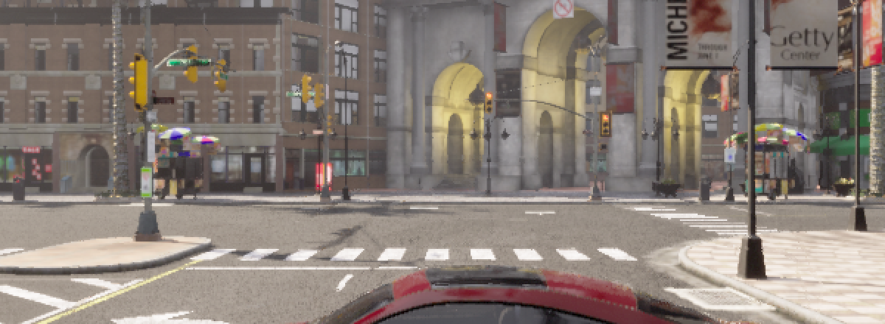
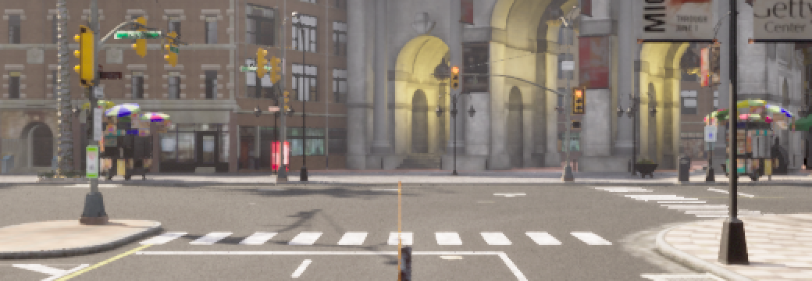

# 3D 场景编辑（3DGS）探索计划

> **本文档定位**：收纳**主线之外**的一个新方向 —— 用 3DGS 做**场景级编辑**（物体移除 / 插入 / 替换 / 布局调整）。
> 主线（P1 corner case 矩阵 + P2 静态 GT + AutoLabel 数据输出）不受影响；本方向的产出**回喂**主线（编辑后的场景是新的 corner case 数据源）。
>
> **写法**（与 [Plan3.md](../Plan3.md) 同一范式）：每条结论附**可复核来源**（本仓文件 / 实测数字），
> 并给出**触发重评条件** —— 没有触发条件的"不采用"等于没结论。
>
> **免责**：本文档结论**不含盘容量约束**。3DGS 产物在 `outputs/`（不入库），盘可扩容。

---

## 0 为什么是这条路：JD → 项目能力映射

目标岗位（`jd_xpeng.md`）四个"研究基础"方向里，本项目唯一有真实积累的是
**3D 场景编辑（基于 NeRF/3DGS 的编辑、点云编辑）** —— 且是"**有重建、没编辑**"：

| JD 要求 | 本项目现状 | 判据 |
|---|---|---|
| 图像编辑（Diffusion / GAN / ControlNet） | **零** | `grep -riE "diffusion\|controlnet\|inpaint\|stylegan" autodrivedata/` ⇒ 0 命中 |
| 图像和谐化 / FID / LPIPS | **零** | 同上 |
| 点云编辑 | **零**（有聚类/分割，没有"编辑"） | `perception/cluster.py`、`extract_ground.py` |
| 域自适应 / 域泛化（方法） | **零**（只有跨域**评测**思路） | [Plan3.md](../Plan3.md) §1.3 |
| **3D 场景编辑（NeRF/3DGS）** | **有重建链，无编辑** | `autodrivedata/gs/train_3dgs_mini.py`（仅训练/渲染/PSNR） |

而 JD 里有一句与整个项目同构的话：

> **"确保仿真数据可用于感知模型训练"**

⇒ 本方向的定位不是"再做一个生成模型"，而是 **把"编辑"插进项目已有的「采集 → 训练 → 评测」闭环**。

---

## 1 家底（实测，可复核）

### 1.1 采集侧 `autodrivedata/sim/collect_3dgs.py`

| 项 | 实测值 | 来源 |
|---|---|---|
| 场景 | **静态**（无 NPC / 车流） | 模块头注 |
| 观测 | 单观众点 **360° 环绕，半径 6 m** | `--radius 6.0` 默认 |
| 帧数 | **270 = 3 俯仰 × 90 相机**（pitch `0 / −15 / −30`） | `outputs/3dgs/capture/pitches.json` |
| 通道 | RGB + **真值深度**（`sensor.camera.depth`） | `depth/p{p}/{i:05d}.npy` |
| 位姿 | **CARLA 真值**（SfM 对齐误差 ~5.7 m ⇒ 弃用 SfM） | `outputs/3dgs/sfm_eval.json` |
| **语义 / 实例** | **已加**（2026-10-04，`--sem` / `--inst`，默认关） | §4 阶段 B.1 ②；重采的 `outputs/3dgs_sync/capture` 四通道齐 |
| **帧同步** | ⚠️ 原实现**整段滞后 2 帧**（不只是第 0 帧） | §1.5 / §4 阶段 B.1 ① |

### 1.2 训练侧 `autodrivedata/gs/train_3dgs_mini.py`

| 项 | 实测值 |
|---|---|
| 光栅器 | gsplat（实测可用版本 **1.5.3**） |
| 初始化 | 真值深度网格反投影，40k / 120k 点 |
| 分辨率 | `_DOWNSAMPLE = 2` ⇒ **621×187** |
| 每步视角 | `_N_VIEWS_PER_STEP = 12` |
| 颜色 | `sh_degree=None`（**无视角相关颜色**，刻意选择） |
| 归档 iters | **1500 – 3000** |

### 1.3 ★ 质量（这是本方向最要紧的一个数）

| 配置 | PSNR(全帧均值) | 文件 |
|---|---|---|
| 40k 点 / 1500 it | 17.90 | `train_result_ep1500.json` |
| 120k 点 / 2000 it | 17.03 | `train_result_mp2_120k.json` |
| 120k 点 / 3000 it | **18.32**（270 帧，最好的一份） | `train_result_mp3_120k.json` |
| 40k 点 / 1500 it | 16.53 | `train_result_mp3.json` |

**参考**：常规 3DGS 在 mip-NeRF360 一类数据集上是 **25–35 dB**。
milestone2 自己把这条链定位为「**降档链路验证**」——**验证了链路通，不是验证了质量**。
（[docs/milestone2.md](milestone2.md) §「3DGS 重建(教程 16,降档链路验证)」）

### 1.4 深度分布（**全部 270 帧**实测，`depth/p{p}/{i}.npy`）

```
<5 m  38.5%   |   5–20 m  60.4%   |   20–50 m  0.6%   |   >50 m  0.5%   |   天空  0.3%
```

三个俯仰基本一致（中位深度 p0 6.4 / p−15 6.4 / p−30 5.9 m）。

⇒ **这是一个 ~20 m 的「近场气泡」**：**99% 的像素在 20 m 以内**。这既好也是约束：
- **好**：物体编辑（移除/插入）本来就发生在近场，判据需要的分辨力正在这里；
- **约束**：单观众点 + 6 m 半径 ⇒ **"场景级"是有限的**（见 §6 待决项 #3）。

⚠️ **别拿单帧下结论**（本轮实测的教训）：`p0` 的**第 0 帧**量出来是「>50 m 占 22.6%、天空 1.1%」，
而其余 89 帧是 **0.0%** —— 那一帧本身有问题，见 §1.5。
「排除天空」在真实分布下几乎是个空操作（0.3%），**分箱才有信息量**（§4 阶段 A）。

### 1.5 ★ 第 0 帧是采集瞬态：**图像与位姿不符**（本轮新发现）

| 判据 | 读数 |
|---|---|
| 位姿 | **正常** —— 与第 1 帧只差 0.42 m / 4°（符合 6 m 半径、4° 步进） |
| 图像 | 与第 1 帧的平均绝对差 **75.4**；而正常相邻帧（1↔2）是 **30.1** |
| 深度 | 中位 **24.6 m** vs 其余帧 **9.4–10.5 m**；上半区亮度 **148** vs 93（大量天空） |
| `>50 m` 占比 | **22.6%** vs 其余 89 帧**全部 0.0%** |

⇒ **那张图不是那个位姿拍的** —— 典型的"首帧取到移动前的画面"，与本仓已记录的
「传感器 `get_transform()` 只在 tick 后刷新」/ §P-V22 的帧同步坑同源。

**后果分三档**：

1. ★ **`--val-frames` 默认 `0` ⇒ 所有归档的 `psnr_val` 都算在这一帧上**。
   坐实：归档里 `psnr_val` 恰好等于 `psnr_all_min`
   （`train_result_mp3_120k.json` 两者都是 **10.45**）。
   **那个数一直是无意义的** —— 本轮曲线改用 `--val-frames 45`；
2. 它的深度进了 `_depth_init_points`(那一函数吃**全部** poses)⇒ 给初始化注入 ~1/270 的远点；
3. 它**不在**训练集里(`--val-frames 0` 把它排除了)⇒ **不是全场 PSNR 偏低的原因**。

> **2026-10-04 更新(本节被后续实测限定,先读这条)**:上面的描述是对的,但**病因比这更广** ——
> 它不是"第 0 帧取到移动前的画面",而是 **CARLA 的传感器投递定额晚 2 个仿真帧** ⇒
> **整段 90 帧全都不是它自己那个位姿拍的**(帧号却一张张对得上)。
> 第 0 帧最显眼只是因为它落在"归位 spectator 那一帧"上。已修(`collect_static_gt.shoot_synced`),
> 新判据与修前/修后读数见 **§4 阶段 B.1 ①**。
> 另:**`--val-frames` 的默认值已从 `0` 改成自动取 5 帧**;`psnr_val` 口径同时受
> §B.4 那个相机系缺陷影响 —— 那一条才是量级上的大头。

---

## 2 ★ 两个结构性优势（本项目做 3DGS 编辑的独特之处）

### 2.1 实例归属是「查出来的」，不是猜出来的

**难点**：3DGS 的每个 Gaussian 只有 `(位置, 尺度, 旋转, 不透明度, 颜色)` —— **没有"属于哪个物体"**。
真实数据上这一步（Gaussian Grouping / 3D 一致性 lifting）要用 SAM + CLIP + 多视角投票去**猜**，且会错。

**本项目的解法**：CARLA 出**逐像素实例 id**（`collect_surround --inst` 已实现：16 位灰度，
像素值 = actor id，R 通道同时带语义类，见 [Plan4.md](../Plan4.md) §P-V15）
⇒ 把每个 Gaussian 投影回每一帧、读实例 id、**投票** ⇒ **精确归属**。

⇒ **这是 SOTA 方法要费力逼近的东西，这里是白给的。**

### 2.2 编辑有「真值靶」

`collect_3dgs` 的相机位姿由 **`collect_rig.ring_cam_pose` 纯函数**算出
（`--center-index` + `--radius` + `--pitches` + `--n-cams`），**完全可复现**。

⇒ 可采**成对**两套：**A（场景 + 道具）/ B（同场景、无道具）**，**相机位姿逐位相同**。
⇒ **物体移除的正确答案是已知的** ⇒ 判据是**逐像素真值**，而不是 FID / LPIPS 这类代理指标。

> 同源先例：§P-V12 的「静态遮挡 A/B」已经是这套思路（只变一个变量、帧级配对、GT 逐帧相等），
> 只是**没接到 3DGS 上**。

---

## 3 ★ 前置硬问题：PSNR 18 就是编辑判据的天花板

**如果重建本身只有 ~18 dB，那么"删掉物体后与真值靶的差"里，重建误差会盖过编辑误差** ⇒ 判据没有分辨力。

这与本仓已记录的几条**是同一类**：

| 已记录的先例 | 同一类问题的形态 |
|---|---|
| GT 出零面积框 ⇒ **recall 天花板被压到 94.3%** | 尺子的系统性折扣 |
| 「AP 尾部不注水」 | 读数不能被无关项撑住 |
| 「σ = 0.025 **是分辨率不是噪声**」 | 效应小于分辨率就不许报 |

⇒ **阶段 A（重建质量诊断）是所有后续阶段的前提**，不是"顺手优化"。

---

## 4 探索阶梯

每阶给：**问题 / 做法 / 判据 / 触发重评条件**。

### 阶段 A · 重建质量诊断（前置，必做）

**问题**：PSNR ~18 的上限在哪？是**没训够**，还是**表示上限**？

**做法**（在**现有 capture** 上跑，不重采）：
1. **iters 曲线**：`1500 / 5000 / 15000 / 30000`（同 capture、同 seed、同初始化）
2. **PSNR 按深度分箱**：`<5 / 5–20 / 20–50 / >50 m` + 天空（`≥999`）
   —— 比"排除天空"有信息量：天空只占 **0.3%**，掐掉它几乎不动全场那个数（§1.4）
3. ⚠️ **`--val-frames 45`**，不用默认的 `0` —— 第 0 帧是采集瞬态（§1.5），
   拿它当验证集等于**量了个坏样本**（归档的 `psnr_val` 就是这么来的）

**判据**：
- iters 曲线**仍在单调上升** ⇒ 上限是**训练预算**，不是表示 ⇒ 补 iters 即可
- iters 曲线**已平台** ⇒ 上限在**表示/初始化**（`sh_degree=None` / 真值深度反投影的点的分布）
- **★ 分箱是关键**：若**近场（<20 m）的 PSNR 明显高于全场**，则**编辑实验根本不必等全场达标** ——
  物体移除/插入发生在**近场**，那里才是判据需要分辨力的地方。
  ⚠️ 但 §1.4 说 **99% 的像素本来就在 20 m 内** ⇒ **分箱能拉开的差距有限**，
  这一点要在读数出来后再判（若各箱几乎相同，说明"分箱"这条在这里不成立，见下面的触发条件）

**触发重评条件**：若近场与远场的 PSNR **无显著差**（都 ~18），则"分箱"这条路不成立，
必须回头解决全场质量（升 iters / 打开 `sh_degree` / 换初始化）。

#### A.1 ★ 实测结果（2026-10-03 ✅ 已跑完）

> ⚠️ **本节整表已作废**（2026-10-04）：它量的是 `legacy` 相机系 —— 见 §B.4 与 **§A.4.1**。
> 保留只为留痕。**判定一/三成立、判定二翻转、绝对值全部不可引用。**

**iters 曲线**（同 capture、同 seed、同初始化、`--val-frames 45`）：

| iters | psnr_all | **val(45)** | 0–5 m | 5–20 m | 20–50 m | 50 m+ | sky |
|---|---|---|---|---|---|---|---|
| 1500 | 17.04 | 15.13 | 16.74 | 16.34 | 14.11 | 15.69 | 23.48 |
| 5000 | 19.19 | 15.83 | 19.36 | 18.22 | 15.72 | 17.30 | 24.31 |
| 15000 | 20.92 | **16.58** | 21.47 | 19.87 | 16.93 | 18.00 | 27.64 |
| 30000 | **21.74** | **16.17 ↓** | 22.34 | 20.68 | 17.83 | 18.76 | 28.29 |

**逐 200 步的 val 轨迹（30000 那次，151 个点）**：`2000→15.10 / 4000→15.92 /
8000→15.88 / 16000→15.88 / 22000→16.26 / 29999→16.17`

**★ 判定一：训练预算不是瓶颈。**
**从 ~4000 iters 起，新视角就锁死在 16.0 ± 0.3 dB**，之后 26000 步（6.5×）没有趋势。
而 `psnr_all`（**训练视角**）同期从 ~18 涨到 21.74 —— **涨的全是"记住了见过的视角"**。
⇒ **加 iters 是无效解**（与本仓既有经验同源：§P-M.17「长训不改善路线级」、
§P-H 的「多采帧数」是无效解）。

**★ 判定二：那个 16 dB 需要参照系才读得出好坏 —— 模型只比"复制"好 1.8 dB。**

| 对照（纯 CPU，无模型） | PSNR |
|---|---|
| 复制最近邻视角（±1 帧 = 4°） | 13.77 / 14.36 |
| 复制 ±5 帧（20°） | 12.89 / 9.86 |
| 复制 ±22 帧（88°） | 12.18 / 7.66 |
| **模型（留出帧 45）** | **16.17** |

⇒ 新视角合成**在起作用但很弱**（+1.8 dB 于最强的平凡基线）。

**★ 判定三：深度分箱拉开的差距有限。**
近场（0–5 m）22.34 vs 全场 21.74 —— **只差 0.6 dB**；最好的一段（0–5 m）也只比 5–20 m 高 1.66 dB。
⇒ §4 阶段 A 预设的触发条件**命中**：「各箱几乎相同 ⇒ 分箱这条不成立」。
根因是 §1.4 那个事实 —— **99% 的像素本来就在 20 m 内**，没有"远景"可拉开。

**★ 判定四（对阶段 C 反而是好消息）：编辑实验发生在 ~22 dB 那一档，不是 16 dB。**
阶段 C 的 A/B 成对采集用**同一批位姿**，删物体后的比较是在**训练视角**上做的
（近场训练视角 **22.34 dB**），不是新视角那 16 dB。

#### A.2 杠杆一「分辨率」：**无效**（2026-10-04 实测 ❌）

> ⚠️ 绝对量级已被 **§A.4.1 ③** 取代（−1.03 → **−0.44**）；**结论「无效」保留**。

`--downsample 1`（原生 1242×375，4× 像素）：

| 配置 | 耗时 | `psnr_all` | **val(45)** |
|---|---|---|---|
| D=2（621×187），30k | 11 min | **21.74** | 16.17 |
| **D=1（1242×375），30k** | **25 min** | 20.71 ↓ | **16.32** |

新视角只动 **+0.15 dB**（而 val 曲线本身在 ±0.3 抖动）；训练视角反而**降**了
（同样 120k 个高斯要覆盖 4× 的像素）。⇒ **瓶颈不在输入细节**。

⚠️ 顺带修掉一个**只在 D=2 上碰巧成立**的内参公式（见下 §A.3 末尾）。

#### A.3 ★★ 真正的缺口：**这套实现没有致密化**（adaptive density control）

> ⚠️ **「致密化是缺口、该开」这条已被 §A.4.1 ② 推翻**（2026-10-04，两个 seed 一致）：
> 相机系修对之后致密化**几乎不触发**（+5% vs legacy 的 +805%），而且它**同时伤训练视角
> 与留出视角**（`psnr_all` Δ = −1.06 / −1.08）⇒ **`--densify` 该关**。
> 本节以下内容保留作机制留痕（"为什么 legacy 下它看起来那么有用"）。

查训练循环：

```python
means = nn.Parameter(points.detach().clone())  # 120k 固定
for it in range(iters):
    rend = render(bidx)
    loss = mse
    loss.backward()
    optim.step()
```

**高斯数量从头到尾恒等于深度反投影的 120k** —— 没有 clone / split / prune / reset。
而**自适应密度控制是标准 3DGS 的核心组件**（Kerbl et al. 2023）：从稀疏点周期性
在**重建不足的区域克隆**、**分裂过大的**、**剪掉透明/超尺度的**，数量从 ~1e5 长到 ~1e6。
没有它，模型只能挪动与缩放初始点，**无法在几何错的地方补高斯**。

⇒ 这一条同时解释了 A.1/A.2 的两个读数：
**加 iters 只在训练视角涨**（记忆），**加分辨率不动新视角**（几何本身没修）——
缺的不是优化预算也不是输入细节，是**表示的自适应能力**。

**gsplat 1.5.3 自带 `DefaultStrategy`**（`grow_grad2d=2e-4` / `refine_start_iter=500` /
`refine_stop_iter=15000` / `reset_every=3000` / `prune_opa=0.005`，即官方那套）。
接进去的**接口约束**（已核源码）：

| 要求 | 现状 |
|---|---|
| `params` 键 `means/scales/quats/opacities` | 变量名是 `opac`，需改名 |
| **`scales` 必须是 LOG**（策略里用 `torch.exp(params["scales"])`） | **线性**（0.05 直接传光栅器）⇒ 要改成存 log、渲染时 `exp` |
| `optimizers` **与 `params` 同键**（`check_sanity` 强制） | 单一 param group |
| `info` 需含 `means2d`（带 grad）/ `radii` / `width` / `height` / `n_cameras` / `gaussian_ids` | 只取了 `rasterization(...)[0]` |
| 调用 `step_pre_backward`（backward 前）/ `step_post_backward`（`optim.step()` 后） | 无 |

**做法**：加 `--densify`（**默认关 ⇒ 与归档逐位一致**），开时切到 log 尺度并接上策略。

**判据**：新视角 PSNR 是否突破 16 dB。
- **突破** ⇒ 前面所有"上限"读数都是**缺致密化**造成的，A.1/A.2 的结论要按"这一版实现"限定
- **不突破** ⇒ 表示层面还有别的问题（单观众点 6 m 视差 / 视角覆盖），继续查

##### A.3.1 接线踩的四个坑（全部"报错指不到真因"，逐个留痕）

| # | 现象 | 真因 |
|---|---|---|
| 1 | `ValueError: Unknown CUDA arch` 之类无关报错 | `scales` 策略要 **log**，实现存线性 |
| 2 | `IndexError: tuple index out of range`（在 `torch.where(sel)[1]`） | gsplat 1.5.3 的 `rasterization` 返回 **packed** 形式（`radii [nnz,2]`），策略默认走 non-packed 分支 |
| 3 | 尺度落盘后**几乎没动**（中位 0.063、范围 0.028~0.105，初始就是 0.05） | **只换参数化没换 lr**：线性 1e-3 是 2%/步，log 下同样 1e-3 只有 0.1%/步 |
| 4 | `AssertionError: torch.Size([N,3])`（gsplat 里关于**颜色**形状的断言） | 颜色**不在**策略的 `params` 里 ⇒ 增删时没被同步；后改成 `sh0` 键进 `params`/`optimizers`，**且渲染与落盘都必须走 `_params["sh0"]`**（用局部变量就还是旧张量） |

⚠️ **第 4 条是本轮最值得记的一类**：策略是**替换字典里的张量对象**（不是原地改），
所以**任何还攥着旧局部变量的地方都会静默用回旧参数**。本轮在 `rasterize` 与落盘两处各栽了一次。

##### A.3.2 ★ 致密化**确实生效**了

第一版修到能跑之后，落盘处报：

```
ValueError: ... the array at index 0 has size 882975 and the array at index 2 has size 120000
```

**882975** —— 高斯从初始 **120,000 长到 882,975（7.4×）**，即 `DefaultStrategy` 真的在
clone/split/prune。中间读数：`train_loss` 从无致密化的 ~0.008 降到 **0.0040**（训练拟合明显变好）。

**终值**（30000 iters，`--val-frames 45`）：

| 配置 | 高斯数 | `psnr_all`（训练视角） | **val(45)（新视角）** |
|---|---|---|---|
| 无致密化 | 120,000 | 21.74 | **16.17** |
| **致密化** | **1,024,704**（8.5×） | **24.90** | **12.49** |
| Δ | 8.5× | **+3.16** | **−3.68** |

⇒ **致密化把训练视角推到 24.9 dB（进入常规 3DGS 的 25–35 区间），却让新视角掉了 3.68 dB。**
1M 个高斯拟合 269 个视角 = **过拟合**。⇒ **容量不是瓶颈**："加高斯"与"加 iters"一样，
买到的都是**训练视角**。

##### ⚠️ A.3.3 **但这个结论现在还不能定**：本模块全程**没有 seed**

`np.random.choice`（每步取哪 12 个视角）、`torch.rand`（初始颜色）、`torch.randperm`
（深度初始化抽样）—— **一处都没固定**。证据（**同一份代码**）：

| 跑次 | iter ~19000 的 `val_psnr` |
|---|---|
| 修通后第一次 | **15.74** |
| 修完落盘后那次 | **11.29** |

**⇒ 跑间方差达 4.5 dB**，而上表那个 −3.68 的差**并没有显著大于它** ⇒ **判不了**。
**2026-10-04 已补 `--seed`（默认 0，三处随机源全固定；`--seed -1` 回到旧行为）**，
并重跑带 seed 的 A/B。

##### ⚠️ A.3.4 ★ 但第一版 `--seed` 是**假的**：补在前面、被后面覆盖回 0（2026-10-04 修）

补 `--seed` 的那次改动**只加在了前面**，而 `main` 里原有的一对
`torch.manual_seed(0)` / `np.random.seed(0)` **原封不动留在后面**（`dev = "cuda"` 之后、
`_load_poses_and_cams` 之前）：

```python
if args.seed >= 0:  # ← 新加的
    np.random.seed(args.seed)
    torch.manual_seed(args.seed)
    torch.cuda.manual_seed_all(args.seed)
...
dev = "cuda"
torch.manual_seed(0)  # ← 原有的,把上面**静默覆盖回 0**
np.random.seed(0)
```

⇒ 两个声明同时是假的：**`--seed 5` 与 `--seed 0` 跑出逐位相同的结果**（参数是个摆设），
而 **`--seed -1`（help 写"回到旧的自由随机行为"）同样被确定化**。
覆盖**不报错、不改变任何输出形状** —— 只有"换个 seed 数字、结果一模一样"才看得出来。

**修法**：抽成 `_seed_everything(seed)` 单函数（`seed < 0` 直接 return），把调用点后面那两行删掉
—— 让"只 seed 一次"成为**结构**，而不是靠读 `main` 推。
**判据**（`tests/gs/test_train_3dgs_mini_env.py` 的 `TestSeedEverything` / `TestNoClobber`，4 条）：① helper 钉住 torch/numpy；
② **换 seed 必须换序列**（这就是原 bug 的直接反例）；③ `-1` 不动上游状态；
④ **源码顺序**——`_seed_everything(args.seed)` 之后到 `_load_poses_and_cams` 之间不许再出现
`manual_seed` / `.seed(`（同 `TestCheckpointFinalizeOrder` 的纪律；行为测试要真训几小时）。
**反向自证**：把那一行手动放回去，④ 当场变红；删掉，4 条全绿。

⚠️ **已归档的数不受影响** —— 此前所有跑次要么带 `--seed 0`（本来就是 0），要么没给过 `-1`。

##### ★ A.3.6 **`--seed` 不给逐位复现** —— 它管不到 CUDA 原子序（2026-10-04 实测，纠正上面那条）

§A.3.4 收尾原写「`--seed` 让**同 seed 的两次跑逐位可比**」—— **那句是错的**，实测推翻，留在此处作对照。

**证据**：三次**逐字相同**的命令（同 capture / 同 `--seed 0` / 同 30000 iters / 同 build），
produces 不同的数：

| 跑次 | `.so` 的 build | `psnr_all` | val 均值 | val45 |
|---|---|---|---|---|
| 08:34 | CUDA **13.0** | 30.18 | 26.42 | 23.96 |
| 09:22 | CUDA **11.8** | 30.10 | 27.33 | 27.08 |
| 11:52（正式模型） | CUDA **11.8** | **30.18** | **27.41** | **27.26** |

**同一个 build 的两次**（09:22 vs 11:52）差的量级：

| 指标 | 同 seed 重跑极差 |
|---|---|
| `psnr_all`（训练视角） | **0.08 dB** |
| val 均值（5 帧） | **0.08 dB** |
| `val45`（单帧） | **0.18 dB** |

**机制（gated，不是猜的）**：gsplat 的 `rasterize_to_pixels_3dgs_bwd` 用 **`atomicAdd`
累加梯度** ⇒ 浮点加法顺序随线程调度变。**`--seed` 固定的是采样与初始化，管不到它。**
⇒ 本模块是「**同 seed 可重复但不可逐位复现**」。

⚠️ **这条改写了 §A.4.1 里用过的"分辨力"**：那里拿"两个 seed 的极差"当分辨率（`psnr_all` 0.01），
**低估了** —— 同 seed 重跑的极差就是 0.08，是两个 seed 那对的 8 倍。**n=2 的极差不是分辨力。**
（结论没翻：densify 的 Δ = −1.06/−1.08 仍 ≈ **13×** 这个 0.08，见 §A.4.1 ②。）

⚠️ **未决、不许写成因**：三次里 CUDA 13 那次 val 偏低（26.42 vs 27.33/27.41），
看着像"**换 build 会动 val**"，但**那是 n=1**，而同 build 的两次只差 0.08 ——
**分不清是 build 还是那 0.08 的那类抖动**。**跨 build 的 PSNR 差多少，目前没有数字。**
（这正是 §A.4.0 那条"换 build 不许混比"的实话：不是"已经知道差多少"，是"**不知道**"。）

⚠️ **它和本仓那条 AP 的 2e-3 下限是两回事、量级也不同**：AP 那个是**阈值边界抖动**
（边界实例的 sigmoid 得分跨过 `--score-thr` 就翻面），这里是**浮点累加顺序**。
**两个数不能互相引用。**

##### A.3.5 ★ 带 seed 的 A/B：**densify 是真的**（2026-10-04 定案 → ⚠️ 同日被 §A.4.1 ② 推翻）

> ⚠️ **本节结论（"`--densify` 定为开着"）作废**：那是 **legacy 相机系**下的读数。
> carla 口径下两个 seed 一致给出 **densify 更差**（§A.4.1 ②）。保留作对照 ——
> 它正好固定了"同一机制在两个相机系下的两种样子"。

同 capture、`--seed 0`、30000 iters、`--val-frames 45`，**只翻 `--densify`**：

| 臂 | `psnr_all`（训练视角） | `psnr_val`（帧 45） |
|---|---|---|
| `_S0nodens` | 21.79 | **16.66** |
| `_S0dens` | **24.82** | 14.31 |
| Δ | **+3.03** | −2.35 |

**⇒ 上面那个"−3.68 判不了"现在能判了**：种子钉死之后，densify 的效果干净地分离出来，
方向与量级都和 §A.3.2 一致 —— **它拿新视角换训练视角**。

**它对我们究竟是赚是亏取决于用途**：阶段 C 的编辑 A/B 用**同一批位姿**，比的是**训练视角**
⇒ **`--densify` 定为开着**（§6 决策项据此关闭）。

⚠️ 三条读数边界：① `psnr_all_mean` 是**全帧**均值、**含** val 帧；扣掉后 21.85 → 24.94，
**+3.09**，方向不变。② 新视角那 **−2.35 是 `n = 1` 帧**、**不是分布**，
不能说成"densify 让新视角掉 2.4 dB"。③ 与 §B.4 同源：这一表是 **legacy 相机系**下的读数。

#### A.4 ★ carla 口径重跑（2026-10-04，**取代 A.1–A.3 三条杠杆的结论**）

§B.4 实测 `_load_poses_and_cams` 的相机系**不是** CARLA 的 ⇒ A.1/A.2/A.3 量的是
**带 bug 的实现**。**2026-10-04 用户裁决：按 `--cam-convention carla` + 修好的 capture
（`outputs/3dgs_sync/capture`）重跑三条杠杆。** 口径：

```bash
python -m autodrivedata.gs.train_3dgs_mini --capture outputs/3dgs_sync/capture \
  --cam-convention carla --seed 0 --iters <N> [--densify] --tag _C<N>
```

- iters 档**原样保留 §A.1 的 1500/5000/15000/30000**（好对曲线形状）；
- `--seed 0` 全钉；留出集走**新默认** `auto_val_frames(270) = [45,90,135,180,225]`
  —— 帧 45 仍在里面 ⇒ 与 §A.1 的 `val(45)` **可直接配对**；
- 额外一档 **`--densify` @30000**：A.3.5 那个"densify 值得开"的结论是在 **legacy** 下量的，
  改口径后要复核它成不成立（编辑线按它开着走）。

> ⚠️ 上面 `--cam-convention carla` 是**跑的时候显式给的**（那时默认还是 `legacy`）。
> 本节跑完之后默认已被翻成 `carla`（§6 #6）—— **命令里保留这个参数是刻意的**：
> 报数必须写明口径，别让它依赖"当时的默认值是多少"。

##### A.4.1 ★ 实测结果（2026-10-04）

三种读数并列，别混：**`psnr_all`** = 逐帧 PSNR 再平均（265 训练 + 5 留出）；
**`val45`** = 单帧 45，**与 §A.1 直接配对**；**`val 均值`** = 5 留出帧平均。

**① iters 曲线：上限不是 16 dB，是 ~27 dB**

| iters | `psnr_all` | `val45` | `val 均值` | 0–5 m | 5–20 m |
|---|---|---|---|---|---|
| 1500 | 26.15 | 24.85 | 25.30 | 25.01 | 24.01 |
| 5000 | 27.99 | 25.74 | 26.35 | 26.63 | 25.44 |
| 15000 | 29.42 | 26.83 | 26.75 | 27.90 | 26.59 |
| 30000 | 30.10 | 27.08 | **27.33** | 28.62 | 27.24 |

（末两列取自产物 `psnr_by_depth`；两桶合计 99.1% 的像素，其余是 20 m+ 与天空）

**判定一（修正 §A.1）：不是"锁死 16 dB"，是"强次线性"。**
20× iters 换来 val **+2.03 dB**，但收益**强烈递减**：1500→5000（3.3×）**+1.05**、
5000→15000（3×）**+0.40**、15000→30000（2×）**+0.58**。
同期 `psnr_all` 涨 **+3.95** ⇒ 涨的仍然主要是**"记住见过的视角"**。

⚠️ **"30000 处到底平没平台"本轮判不了，别写成结论**：+0.58 是同 seed 重跑极差
（**0.08**，见 §A.3.6）的 **7 倍**，但那个极差**只有 2 个样本** —— 按本仓
「n=2 的极差不是分辨力」那条纪律，它既不足以判"已平台"、也不足以判"还在涨"。
**能说死的是**：20× 算力换 +2.03 dB，**这个交换不划算**。
⇒ **§A.1 判定一的实用结论（别靠加 iters）成立；"新视角锁死 16 dB" 是 bug 造的，作废。**

**判定二（翻转）：模型比"复制最近邻"好 ~11 dB，不是 1.8 dB。**

| 对照（纯 CPU、无模型、同一份 capture、同一下采样） | PSNR（5 留出帧中位） |
|---|---|
| 复制 ±1 帧（4°） | 15.66 / 16.10 |
| 复制 ±5 帧（20°） | 13.25 / 10.65 |
| 复制 ±22 帧（88°） | 11.36 / 11.09 |
| **模型（5 留出帧均值）** | **27.33** |

⇒ **新视角合成是真在起作用**，不是"只比复制好一点"。
⚠️ §A.1 那组基线（13.77 / 14.36）与本次不同（归档 capture，且算法口径未留痕）
⇒ **两组别混用**；要引用就用本节这组（与模型读数同 capture 同口径）。

**判定三（成立）：深度分箱仍然拉不开。** 最好的 0–5 m（28.62）比该臂全场（27.71）
只高 **0.91 dB**，5–20 m 是 27.24 —— 与 §A.1 同形。根因仍是 §1.4：**99% 的像素本来就在 20 m 内**。

**② ★ densify：翻转，且两个 seed 一致 —— 该关**

| seed | 臂 | `psnr_all` | `val45` | `val 均值` | 终值高斯（初值 120000） |
|---|---|---|---|---|---|
| 0 | `_C30000` | 30.10 | 27.08 | 27.33 | 120000（1.00×） |
| 0 | `_C30000D` | 29.04 | 24.69 | 24.82 | 127399（1.06×） |
| | **Δ** | **−1.06** | −2.39 | −2.51 | |
| 1 | `_C30000_s1` | 30.09 | 26.02 | 26.91 | 120000（1.00×） |
| 1 | `_C30000D_s1` | 29.01 | 24.98 | 25.49 | 126458（1.05×） |
| | **Δ** | **−1.08** | −1.04 | −1.42 | |

**⇒ §A.3.5 那句「`--densify` 定为开着」作废，改成关。**
两条独立 seed 上 densify 在**训练视角与留出视角上同时更差**；`psnr_all` 的 Δ
在两个 seed 上是 **−1.06 / −1.08** —— 对**同 seed 重跑极差 0.08**（§A.3.6）是 **≈13 倍**，
且**两个 seed 同号同量级**，不是噪声。
（⚠️ 先前此处写"25 倍"，用的是"两个 seed 的极差 0.01"当分辨力 —— 那个数**低估了**，
见 §A.3.6。倍数改了，**结论没改**。）

**机制 —— 能测的那一半（触发量）**：致密化是**梯度驱动**的（`grow_grad2d=2e-4`），
而它在两种相机系下的**触发量差得离谱**：

| 口径 | 终值高斯数 | 相对初值 |
|---|---|---|
| legacy（§A.3.5） | **1,085,927** | +805% |
| carla（本节） | 126,458 / 127,399 | **+5% / +6%** |

⇒ legacy 那轮**几何整体错位 ⇒ 一直欠拟合 ⇒ 梯度大 ⇒ 致密化疯狂触发**，
那 **+3.03 dB 买的是"补容量"**。相机系修对后模型**一上来就拟合得好**，
致密化几乎不触发 ⇒ **它不再是补容量，只剩下 prune/reset 对已收敛解的扰动**。
⚠️ **「是 prune/reset 而不是容量」是假设，没测** —— 没拆开 `DefaultStrategy` 的各分支。
**能测的那一半（触发量 8× 之差）列在上面，那一半是实测。**

**③ 分辨率：无效，另有一个小负效应（§A.2 结论保留、量级修正）**

| `--downsample` | `psnr_all` | `val45` | `val 均值` |
|---|---|---|---|
| 2（621×187） | 30.10 | 27.08 | 27.33 |
| 1（1242×375） | 29.66 | 27.02 | 27.19 |
| Δ | **−0.44** | −0.06 | −0.14 |

`psnr_all` 的 −0.44 是同 seed 重跑极差（**0.08**）的 **5.5 倍** ⇒ 训练视角**确实更差**；
val 上的 −0.06 / −0.14 **落在 0.08 的量级内** ⇒ 留出视角**读不出差别**。
⇒ §A.2「分辨率无效」成立；§A.1 记的「4× 像素换 −1.03」量级缩到 **−0.44**。

**④ 对主线的净影响：方向不变，依据变强**

§A 的战略结论（**别再继续调重建，去做编辑**）**不变**，而且依据更硬：

- 重建本身是好的 —— 新视角 **27.3** / 训练视角 **30.1**，比平凡基线高 **~11 dB**，
  不是"撑不住判据"；
- 三个杠杆：两个无效、一个（densify）**负** ⇒ **能调的地方已经调完了**；
- 编辑 A/B 在**同一批位姿**上做 ⇒ 判据的分辨力在 **~30 dB** 那一档，
  比 §A.1 记的 22 dB **更好**。

**战术上唯一要改的一件事：`--densify` 关掉。**

⚠️ **分辨力用的是哪个数，本节的倍数全靠它** —— 本节初稿拿「两个 seed 的极差」当分辨力
（`psnr_all` 0.01），**那是错的、且偏乐观**：真正的下限是**同 seed 重跑**的极差
（`psnr_all` **0.08** / val 均值 **0.08** / `val45` **0.18**，见 **§A.3.6**）。
**两者都是极差、都不是 σ**；但这个对比本身说明白了一件事：
**"换个 seed 跑一次"估不出分辨力** —— 它可能比同 seed 重跑还小（本轮就是），
于是任何"Δ 是它的 N 倍"的说法都会被系统性放大。


##### ⚠️ A.4.0 脚注：**跑之前先按头注的配方带 CUDA 环境**（2026-10-04 代价实测 ≈1 h）

`train_3dgs_mini` 的头注「用法」一节**早就写了**：

```bash
CUDA_HOME=/usr/local/cuda-11.8 PATH=/usr/local/cuda-11.8/bin:$PATH \
  python -m autodrivedata.gs.train_3dgs_mini ...
```

**漏掉的后果不是"跑不起来"** —— 而是两种，第二种更毒：

| 情形 | 现象 | 险 |
|---|---|---|
| 没设 `CUDA_HOME` / PATH 上没有 11.8 的 nvcc | 编译期 `fatal error: crt/host_defines.h`（**响亮**） | 低 |
| 补上了 CUDA 13 的头文件路径 | **构建成功**，产出的 `.so` 要 `libcudart.so.13` —— **静默替换掉规范那份** | **高** |

机制：torch 的 JIT 缓存按**构建 flags 的 hash** 定位 `.so`。环境不同 ⇒ hash 不同 ⇒
**它会重新编译并覆盖**，而不是报"环境不对"。所以「上次能跑」不构成任何保证。

**实测代价**：一次误用把规范 `.so`（16,466,672 B @10-03 22:42，CUDA 11.8 编）换成了
CUDA 13 编的 13.7 MB 那份；**那一整轮 sweep 因此不可归属**（归档的 §A/§B 全部数字都出自
11.8 那份），只能整轮重跑。

**复苏**：删缓存 → 按头注配方重建 → **产物与归档那份同尺寸**（16,466,672 B），
`from gsplat.cuda._backend import _C` 通过。

⚠️ **两条纪律**：
1. **凡是要 import gsplat 的命令，一律带文档配方的那两个环境变量**，包括一次性的探针
   `python -c "import gsplat"` —— 探针也会触发重建、也会覆盖。**别拿它当"只是看看"**。
2. **换 build 的数不许混比** —— 与「跨机器/跨机型的 AP 不许直接比」同一条。跨 build 的
   PSNR 差多少**没测过**，不写成因。
3. **runlog 的环境指纹不含 `CUDA_HOME` / `LD_LIBRARY_PATH`** —— 出事后查不出当时是哪个
   build。这是指纹的一个真缺口（待补，见 §6）。

**处置（2026-10-04，已做）**：模块里加 `CUDA_NOTE` —— **在 `import gsplat` 之前**，
`CUDA_HOME` / `CUDA_PATH` 都没设就**打一行醒目告警**（点名那会用哪个 `nvcc`），
并把 `CUDA_HOME` 写进 runlog 的 highlight（跨 build 不许混比，那要求事后查得出来）。
**只报不拦**：拦下来会挡住"有意换 build"这种正当用法，而真正要防的是**不知情**。
判据 `tests/gs/test_train_3dgs_mini_env.py::TestCudaNote`（4 条），
其中 ★ **告警块必须排在 `import gsplat` 之前** —— 排在后面等于没告警（那时已经重编完了）。
**反向自证**：把整块挪到 import 之后 ⇒ 判据当场变红；挪回 ⇒ 全绿。
⚠️ **`pytest` 不会触发重编**（实测 `.so` 的 mtime 不变）—— 因为 `import gsplat` 是惰性的，
`_C` 只在真调光栅化时才加载。

⚠️ 顺带一条**同类自匹配坑**（本轮又踩一次）：`pkill -f "train_3dgs_mini"` 会匹配到
**它自己那条命令行**，把 shell 一起杀掉（退出码 144）。用 `pkill -f "train_3dgs[_]mini"`。


⚠️ **顺带修掉的第二个「只在 D=2 上碰巧成立」**（2026-10-03）：
`_load_poses_and_cams` 的主点旧写法 `(cx_orig+1)/D` 之所以对，是因为
`(cx+1)/2 = cx/2 + 0.5` —— 那个 `1/D` 与 corner→center 的 `+0.5` **撞上了**。
通式是 `cx_orig/D + 0.5`：D=2 逐位不变（归档不受影响），但 **D=1 差 0.5 px、D=4 差 0.25 px**。
同本函数上面记的 `1242/2/(2·tan45°)` 是同一类坑，只是高了一层。

### 阶段 B · Gaussian → 实例归属（地基）

**做法**：`collect_3dgs.py` 加 `--sem` / `--inst`（与 `collect_surround` 同一份挂载代码，
**同挂点同 fov**）；训练后把每个 Gaussian 投影回每帧读实例 id，投票。

**判据**：**跨视角标签一致性** —— 只在某实例可见的视角子集上投票，与全体投票比；
不一致率就是归属误差的直接读数。

**触发重评条件**：若归属误差大到无法区分相邻物体，则退回到"只做**类级**编辑（删掉所有 `Car`）"，
类级判据仍然成立（`sem_tags` 已有完整类表）。

#### B.1 ★ 实测结果(2026-10-04)

三件事都做完,`--self-test` + 反向自证 + 真数据全跑过。**但 B 的过程中挖出一个更大的前置缺陷**
(相机系),它反过来改写了 §A 的结论 —— 见 §B.4,**那一条比本阶段的归属结果更重要**。

##### ① 帧同步:根因**不是**"FIFO 攒陈旧帧",是**投递定额晚 2 帧**

原判断(§1.5 的处置设想)是"预热多 tick 少 get ⇒ 队列残留 ⇒ FIFO 取到最旧"。**实测的机制不是这个**:
直读 `world.get_snapshot().frame` 与 `Image.frame`,差值**恒为 2、不累积** ——

```
i=0 world_frame=19069 img.frame=19067 差=2
i=1 world_frame=19070 img.frame=19068 差=2
```

⇒ "每 tick 取一帧(FIFO 取最旧)"这条口径**整段序列滞后 2 帧**,而**帧号一张张对得上**、
几路相机也彼此同步(`assert_synced` 不报错)。预热那 3 次多出的 1 帧只决定了第 0 帧长什么样。

**后果比 §1.5 记的更广**:不只是第 0 帧。环形每帧转 4°,2 帧 = **8° 的系统性位姿错位**,
89 帧全错 —— 只是"每帧都差 4°"在相邻帧差这种统计量上看不出来。
判据(`autodrivedata/gs/frame_sync.py`,逐帧远点占比 / 中位深度 / 相邻帧平均绝对差):

| capture | 俯仰 | 首帧中位深 | 其余 `[p5, p95]` | 首帧 `>50 m` | 其余中位 | 首帧相邻差 | 其余相邻中位 | 裁决 |
|---|---|---|---|---|---|---|---|---|
| 归档(2026-09-18) | 0 | **24.6** | [2.3, 14.1] | **0.2264** | 0.0000 | **75.4** | 27.4 | ❌ |
| | −15 | 9.1 | [0.7, 9.1] | 0.0001 | 0.0000 | **71.5** | 27.1 | ❌ |
| | −30 | 8.3 | [0.7, 7.5] | 0.0000 | 0.0000 | 36.1 | 20.5 | ❌(中位落在区间外) |
| **重采(修复后)** | 0 | **9.4** | [2.2, 14.1] | **0.0000** | 0.0000 | 28.8 | 19.9 | ✅ |
| | −15 | 8.4 | [0.7, 9.1] | 0.0000 | 0.0000 | 20.4 | 20.7 | ✅ |
| | −30 | 6.6 | [0.7, 7.5] | 0.0000 | 0.0000 | 10.5 | 11.9 | ✅ |

**修法**:新增 `collect_static_gt.shoot_synced` —— 设位姿 → tick → 记下 `snapshot.frame` →
反复"排空 + 取 **≥ 目标帧**的最新帧"直到每路到齐(**旧帧一律不取**)。这是 `settle` 的形态
按本采集器(单相机 attach 到 spectator、逐帧 `set_transform`)改的结果;
`assert_synced` 仍然每帧跑 —— 它管"几路彼此同不同步",`shoot_synced` 管"是不是当次位姿",**两件事**。
代价是每帧多 tick 2 次。

⚠️ **两条经验**(都是判据本身的教训):
- 判据首版用"其余帧的 `max`"当上界,而"2 帧瞬态"恰好让 `max == 首帧值`(0.2262 vs 0.2264)——
  **差点放过去**。改成**分位数**(p5–p95 / 中位)后 90 帧里坏两三帧再也撑不起上界。
- 首版还拿 `<=` 硬比占比,而两帧都该是 0 时会给出 `3e-6 vs 0.0` 而**判红** —— 加了 1e-4 的绝对容差
  (远小于 §1.5 的 0.226 vs 0.000,比一个像素的占比高两个数量级)。**这不是"调阈值调绿"**:
  它处理的是"两边都是 0"这一种情况,而不是把真实差异判过。

##### ② `--sem` / `--inst`:已加,同挂点同 fov

`collect_3dgs --sem --inst` → `sem/p{p}/{i:05d}.png`(8 位,tag 即像素值)+
`inst/p{p}/{i:05d}.png`(16 位,像素值 = CARLA actor id)。编解码**复用**
`perception/sem_tags` 与 `perception/inst_tags`,不另写一份。**默认关**(关着时与 2026-09-18 那版逐字节一致)。
挂载纪律抽成 `make_kind_blueprints` / `apply_pose` 两个函数,单测用假 `bp_lib` 直接问
"给它设了哪些属性"、"四路是不是同一个 tf" —— 这两处不齐在下游**只表现为"归属错"**。

重采:`outputs/3dgs_sync/capture`(3 俯仰 × 90 相机 × 4 通道 = 1080 个文件)。

##### ③ Gaussian → 实例归属:κ **0.928**,判据**能证伪**

`autodrivedata/gs/attribute_instances.py`(离线、可单测、不绑训练):

| 读数 | 值 |
|---|---|
| 归属率 | **119933 / 120000 = 99.9%**(未归属 67) |
| 命中帧数中位 | 113 / 270 |
| **跨视角一致率**(偶数帧 / 奇数帧各投一次) | **0.9893** |
| 平凡基线(碰撞概率 `Σpᵢ²`) | **0.8444** |
| 打乱对照(B 半标签随机置换) | 0.8525 |
| **κ = (agree − control)/(1 − control)** | **0.9276** ⇒ ✅ |
| **反向自证**:逐帧打乱实例图 | 一致率 **0.9989**(比真值还高!)、κ **0.1192** ⇒ ❌ |

★ **两条都是"仪器先验"的教训**:
- **一致率在这里几乎不是判据**:实例 id 极度倾斜(最大那块网格占 74–99% 像素)⇒ 乱贴都能到 0.844,
  而打乱实例图后一致率**反而升到 0.9989**。**唯一有判别力的是 κ**(0.928 vs 0.119)。
- **判据的裁决式第一版写的是倍率**(`agree ≥ 3×control`,照 `static_eval` 的写法)——
  在这里 `3 × 0.853 = 2.56 > 1.0`,**任何方法都不可能过**,判据会永久红、然后被人调绿。
  改用 κ 是同一个式子的正确算法(减基线、除余量),不是把阈值放宽。

⚠️ **第三条边界**:κ **只在被归属的子集上算** ⇒ **归属率必须先看**。同一份 capture,
`carla` 口径归属 99.9%/κ 0.928;`legacy` 口径只归属 **24.0%**(中位命中帧数 **0**),
可它**被归属的那一小撮** κ 照样 0.917 —— 一个只认下 24% 的方法也能拿高分。

⚠️ **本场景的实例 id 本身就很粗**:`inst/*.png` 里只有 **4–5 个非零 id**,最大一个占 74–99% 的像素
(§P-V15 记过"CARLA 给**每个关卡网格**发 id",Town10HD_Opt 的街区网格就是一大块)。
⇒ 阶段 C 的"删某个物体"在这个场景里只能删到**街区级**。**这不是归属的误差,是数据的粒度** ——
触发重评条件(退到类级编辑)在这里**等价**,因为实例级本来就只有 4 个。

##### B.4 ★★ 挖出的真前置缺陷:训练侧相机系**不是** CARLA 的(改写了 §A 的结论)

归属必须用**CARLA 真位姿**把 Gaussian 投进 `inst/*.png`。但 `train_3dgs_mini._load_poses_and_cams`
的 `rw = Rz(yaw) @ Rx(pitch)` **不是 CARLA 的相机系** —— 它的"光学轴"(gsplat 的相机 +z)
落在 CARLA 相机的 **up 轴**上。三条**互相独立**的实测判据(都不依赖模型好坏):

| 判据 | `legacy`(原口径) | `carla`(本仓 `world_to_img` 口径) |
|---|---|---|
| GT 深度反投影点云的形状(城市街道应从相机水平铺开) | 水平 16.2 m / **竖直 69.7 m** / 中位 z **11.5 m**(悬空) | **水平 68.6 m** / 竖直 11.2 m / 中位 z **2.1 m**(= 相机高度) |
| 帧 1 的深度云投进帧 3/5/7 比色(中位 `\|ΔRGB\|`,0–255) | **40.3 / 52.7 / 54.7** | **7.0 / 11.0 / 16.7** |
| **归档 `means*.npy`**(它在 `legacy` 口径下训出来)按两种口径各自渲染帧 1 的 PSNR | **14.5 dB**(按它自己的口径 —— 自洽,所以拟合本身是好的) | **3.1 dB**(按真位姿 —— 一塌糊涂) |

**处置**:加 `--cam-convention {carla,legacy}`。**当时**默认 `legacy` = 归档逐位一致
(同 `--densify` / `--props` 的纪律),归属实验必须显式给 `carla`。
> **2026-10-04 后续**:§A.4 跑完之后**用户裁决把默认翻成 `carla`**(§6 #6 关闭)。
> 理由:`legacy` 的问题是**它不对** —— 留着它只有"复现归档"一个用途,而那本来就该由
> **显式给参数**表达;把错的留在默认位上,方向是反的。
> 代价是归档产物(§A.1–A.3 的 PSNR 表、`means*.npy`、`gaussians*.ply`)
> **从此要标注口径**,复现它们必须显式 `--cam-convention legacy`。
> 默认值同时抽成常量 `DEFAULT_CAM_CONVENTION`(**唯一落点**),判据
> `tests/gs/test_train_3dgs_mini_env.py::TestDefaultConvention`(4 条,含"两处不许各写一个字面量")。

★ **在修好的 capture 上重跑一遍,量级直接变了**(3000 iters / 120k 高斯,`--val-frames` 默认 = 5 帧):

| 配置 | `psnr_all`(训练视角) | 留出帧 PSNR |
|---|---|---|
| 归档那一档:旧 capture + `legacy`,3000 it / 120k | 18.32 | **10.45 —— 且只有一帧**(= 第 0 帧,采集瞬态;归档 `psnr_val` 全程 = `psnr_all_min`) |
| 新 capture + `legacy`,3000 it / 120k | 20.87 | — |
| **新 capture + `carla`**,3000 it / 120k | **27.30** | **21.68 / 25.09 / 26.15 / 26.36 / 29.92**(中位 **26.15**) |

⇒ **§A.1/A.2/A.3 三条"上限"读数全部要在"这一版相机系 + 这一版帧同步"下重读**:
"新视角锁死在 16.0 dB"、"加 iters 只买到训练视角"、"加分辨率/加高斯都不动新视角" ——
**在同一份数据上把相机系修对,新视角就从 16 dB 到了 ~26 dB**。阶段 A 的结论
**不是被推翻,是被限定**:它们量的是**带这两个 bug 的实现**。**重跑 §A 是下一步的第一件事**
(触发重评条件已命中)。

判据侧(`autodrivedata/tests/gs/test_attribute_instances.py::TestCamConvention`)把这条钉住了:
同一位姿下 `carla` 的 viewmat 与 `world_to_img` 逐点吻合(<1e-3 px),`legacy` 差 >20 px ——
**这条测试能红,所以它才是判据**。

### 阶段 C · 成对采集 + 物体移除（第一个**有真值判据**的实验）

#### C.0 ★ 开工前置:两个「盘上没有任何产物能重建渲染」的缺陷（2026-10-04 已修）

**在写第一行编辑代码之前就卡住了**:渲染一份高斯需要 `means/rots/scales/col/opac`,
而盘上**一个都没有齐过**:

| 产物 | 缺什么 |
|---|---|
| `means/scales/col/opac.npy` | **没有 quats** |
| `gaussians*.ply` | `_standard_ply(pos, col, opac, scales)` —— **签名里根本没有 quats**,`rot` 被硬写成单位四元数 `(1,0,0,0)` |

而 `quats` 在两条训练路径上(致密化开/关)**都是被优化的参数** ⇒
**那份宣称"标准 3DGS PLY"的文件,旋转信息从来不是训练出来的**。
最毒的地方:缺了它渲染**照样跑得起来**(gsplat 不在乎你给的是不是训练出的四元数),
只是结果不是那个模型 —— **不报错,只是错**。

**修**:训练落 `rots{tag}.npy`;`_standard_ply` 收下 quats 并真写进去。
新增 `gs/render_gs.py`(离线渲染器)+ `gs/cuda_env.py`(见下),判据
`tests/gs/test_render_gs.py`(10 条,`test_missing_rots_raises` 是这条的直接反例)。

#### C.0.1 ★ CUDA 环境:同一天第三次踩中,这次是 `pytest`

新增三个要 import gsplat 的入口后,那两件事(设 `TORCH_CUDA_ARCH_LIST`、查 `CUDA_HOME`)
**只长在 `train_3dgs_mini` 里** ⇒ 抽出 `gs/cuda_env.py`。

⚠️ **抽出后又坏了一次,这次是格式化器干的**:按原样写 `import gsplat`,
`ruff format --fix`(isort) 把它**挪到了 `cuda_env` 之前** —— 不变量没了。
⇒ 改成 `cuda_env.ensure_gsplat()`:**顺序由函数保证,不靠文件排布**,
并用 `tests/gs/test_cuda_env.py` 的 **AST 守卫**钉住(除 `cuda_env.py` 外不许顶层裸 import)。

⚠️ **第三次踩中(2026-10-04 当天)**:跑 `pytest` 时**没带 `CUDA_HOME`** ⇒
torch 的缓存 hash 不命中 ⇒ 它重编 → `Error building extension 'gsplat_cuda'`。
这次**规范 `.so` 没被毁**(失败停在编译期,没走到链接;16,466,672 B 未变)。
⇒ **测试套件不该有能力触发重编**:真调 gsplat 的用例现在**没给 `CUDA_HOME` 就跳过并写明原因**
(`_NEEDS_CUDA_ENV`)。跳过在 pytest 里是**可见的第三态**,而"跑了但跑的是被重编过的东西"看不出来。

**三次的形态各不同**(一次训练、一次探针、一次测试套件)—— 共同点是**触发重编的从来不是"我要不要用它"**。

#### C.0.3 ⏸ **C1 搁置(2026-10-04 用户裁决)** —— 采集条件让「编辑靶」不可信

> ⚠️ **本节的归因已被 §C.0.4 改写(2026-10-05)**:卡点**不是 TAA**,是三条独立缺陷
> (道具不渲染 / 尺子无分辨力 / 相机位姿与 `poses_*.json` 差 79.132 m)。
> 尤其:本节那条"道具签名 `4304 → 1653 → 165 → 0`,之后恒为 0"**在归档数据上复现不出来**
> (i≥75 又回到 6000 量级)。**先读 §C.0.4。**

**结论**:C0 三条判据全过、编辑算子与三档判据的代码与自证全齐,
**但这份 A/B 采集里没有可用的编辑靶**。用户裁决**转向 JD 的另一半**(和谐化 / 点云编辑),
本节留作将来重开的起点。

**已核实通过(不受影响)**:

| 判据 | 结果 |
|---|---|
| C0.1 渲染器口径 | **逐帧 Δ 逐位为 0**(均值差 0.0013 = 产物 `round(,2)` 的舍入) |
| C0.2 `--props` | A 有 `prop.json`(`instance_id=44`);**B 没有** |
| C0.3 A/B 配对 | **`max|Δ| = 0.000e+00`**(纯函数位姿,逐位相同) |

**卡点(可复现)**:真实 A/B 里,道具在画面中心框的签名是
`4304 → 1653 → 165 → 0`(i=0..3),**之后 14 帧恒为 0**。复现两次(90 帧的大采集、20 帧的小采集同形)。

**★ 两条相对干净的实验给出的答案相反,没能调和**:

| 实验 | 读数 |
|---|---|
| **真实 A/B**(两次独立进程) | i≥3 之后**恒为 0** |
| **每位姿各取参考**(同进程内把物体挪远再挪回) | **每个位姿都有**(i=0/3/5/10/20/45/70,600–900 px) |

**排除掉的**(每条都是一次实验,别重复):

| 实验 | 排除 / 结论 |
|---|---|
| 静态相机 + `shoot_synced` | 物体**稳定存在**(1612→5001 px)⇒ 帧同步没问题 |
| 两次 sweep 相减 | **该方法本身有 TAA 混淆**;据此报过一次「闪烁」,**是假的** |
| 自己手写排空的探针 | **取到陈旧帧** ⇒ 更早的「闪烁」读数全是它 ⇒ **别手写排空,一律用 `shoot_synced`** |
| 实例通道追 `actor.id` | 静止相机下 spawn 一辆车,实例图里**一个新 id 都没有** ⇒ **`instance_segmentation` 不给后生成的 actor 发 id**,该通道当不了仪器 |
| 三种 z 高度 | 都渲染 ⇒ 不是 z |
| 换 `vehicle.*` | 同一条曲线 ⇒ 不是道具特有 |
| 每帧 `set_transform`(keepalive) | 数字**爆掉**(15000–34000)⇒ 不是修复 |
| 相机改挂真实 actor | 混杂(锚点车自己在画面里)⇒ 未定论 |

**没排除、也没确立**:为什么真实采集与同进程实验相反。**不写成因。**

**重开时的第一件事**:设计能把 TAA 混淆**彻底**排掉的对照(候选:每帧强制渲染状态重置 /
换 CARLA 版本做对照 / 用 `collect_ab_route` 那套 **ego 挂载**的采集器 —— 它与本采集器的
唯一结构性差别是**相机锚点**:`collect_3dgs` 挂 `spectator`,而本仓其它采集器全挂 ego,
后者的道具判据(`prop_eval` coverage **84/84**)是全绿的)。

#### C.0.2 ★ C1 的代码已就位(2026-10-04)—— **只差 GPU 出数**

| 模块 | 作用 |
|---|---|
| `gs/edit_gs.py` | 按实例 id 删高斯。两条纪律:`-1`(未归属)一个不许动;请求的 id **命中 0 个必须抛**(静默成功会让下游把「编辑前后一模一样」读成「这个物体删不掉」) |
| `gs/eval_edit.py` | **三档 + 分区**判据(不编辑基线 / 编辑后 / **天花板**),外加 **A/B 配对硬门槛**(`max|Δ| > 1e-6` 直接拒) |

判据 23 条(`tests/gs/test_edit_eval.py`),三档读数有**手算锚点**;
**冒烟还抓到两条接线问题**(`--list` 被 `--out-tag` 卡住、`-1` 的拒绝发生在读盘之后),各自补了钉。

⚠️ **仍未跑**:C0.1 的 `render_gs --verify-json`(复算 PSNR 与产物对账)与 C1 端到端 —— 都要 GPU,
而 GPU 被 MapTR 四臂重训占着(~11 h)。**"代码齐了"不等于"判据通过了"**,
这两条在 #62 里结清。


#### C.0.4 ★★ TAA 对照做完了 —— **卡点不是 TAA,是三条独立的缺陷**(2026-10-05)

§C.0.3 留的"重开时的第一件事"是"设计能把 TAA 混淆彻底排掉的对照"。**做完了,结论是:TAA 不是因。**
三条缺陷各自独立、各自有实测判据,下面按"发现顺序"列 ——
**这一节的写法本身就是一条教训:三条里有两条是我在追 TAA 时撞上的,而它们都不是 TAA。**

##### ① 道具资产**根本不渲染**(不是"闪烁"、不是"被挡")

判据 = **同相机、同位姿、只换物体类型**:

| 物体 | 摆位 | 画面差 >8 的像素 |
|---|---|---|
| `static.prop.warningconstruction` | 环心(相机正前 6 m)| **9680** |
| 同道具,贴到相机前 14 m | | **9718** |
| **`vehicle.*`(一台车)** | **环心(相机正前 6 m)** | **139313** |

⇒ **车渲染、道具不渲染**。而 `spawn_prop_at` 报告 `残差 0.0000 m`、`prop.json` 也正常落盘
—— **actor 存在,只是不出图**。

中心裁剪放大,**同一台相机、同一个摆位**:

| 摆一台车 → 在 | 摆道具 → **不在** |
|---|---|
|  |  |
⚠️ **与本仓既有经验冲突,未定论**:`collect_ab_route --occluders` 用的也是 `static.prop.*`,
而 `prop_eval` 的 coverage **84/84 全绿** ⇒ **那些是渲染的**。
两者差在哪(**资产?挂载?地图?**)**没测**,**不写成因**。

##### ② ★ 逐像素签名这把尺子**没有分辨力**(它才是 §C.0.3 两条实验矛盾的因)

全部在**不挂 spectator 的世界位姿相机**上量,统计量 = 差 >8 的像素数(不是 `max|Δ|` ——
单像素统计没有判别力,第一版用它量出"恒在 107–130 永不收敛",读不出东西):

| 组 | 读数 |
|---|---|
| F1 同位姿**连续 16 帧**的相邻帧差 | **2043**(末 8 帧最大);且首帧 123317 → … → 2043,**永不收敛到 0** |
| F2 相机**移走再移回**(画面里什么都没变)| **22189** ← TAA 历史效应 |
| F3 道具 @6 m | **9680** |
| F4 **阳性自证**:同一道具从 6 m 挪到 14 m | **9718** |

**★ F4 是最致命的一条**:物体从 6 m 挪到 14 m(画面上小了一大截),读数**纹丝不动**
⇒ **这个量不是物体贡献的**,是"spawn 一个 actor"本身的渲染扰动。

⇒ **§C.0.3 那两条互相矛盾的实验,两个读数都在噪声里**:
"真实 A/B 里 i≥3 之后恒为 0" 与 "同进程各位姿都有 600–900 px" —— **600–900 < 本底 2043**。
**它们矛盾不是因为哪个错了,是因为都在读噪声。**

⚠️ **顺带更正 §C.0.3 里一条数**:它记的是"道具签名 `4304 → 1653 → 165 → 0`(i=0..3),之后恒为 0"。
在归档 `outputs/3dgs_ab` 上重算(中心 1/3 见方框、阈值 8):**i=0..12 是 11673→117,
但 i=75/78/81/84/87/89 又回到 177/621/2029/3799/5689/6325** —— **不是"之后恒为 0"**。

##### ③ ★★ 另挖出一条独立的采集侧缺陷:**相机位姿与 `poses_*.json` 差 79.132 m**

**发现路径**:道具明明摆在环心、相机明明绕环心转,却不在画面里 ⇒ 查相机到底在哪。

代码在 `collect_3dgs.main()`:

```python
x, y, z, yaw_cam = ring_cam_pose(center.x, center.y, center.z, ...)  # ← 返回**世界坐标**
tf = carla.Transform(carla.Location(x, y, z), ...)
apply_pose([cam, ...], tf)  # ← cam 是 attach 到 spectator 的
```

而采集器**自己的注释**写着"attach 子 actor 的 `set_transform` 是**相对父 actor**的位姿"。

**判据一(读回实测)**:`set_transform` → `tick` → **读回** `get_transform()`
(不 tick 读到的是陈旧快照 —— 我在 M3 就栽了一次,那次读回 = 父的位姿,把我引向错误方向):

| 请求(x,y,z) | 读回(x,y,z) | 读回−请求 | 模长 |
|---|---|---|---|
| (-72.034, 12.967, 2.100) | (-150.068, 25.934, 4.200) | (-78.034, +12.967, +2.100) | **79.132** |
| (-81.034, 18.163, 2.100) | (-159.068, 31.130, 4.200) | 同上,**恒定** | 79.132 |

**差值逐分量恰好 = spectator 的世界位置 ⇒ 确认是"相对解释",不是别的。**
(采集器把 spectator 挪到环心那一步**没有消掉**这个偏移,反而**引入了它**。)

**判据二(渲染等价,不依赖读回)**:三臂,**A** 挂 spectator + 传请求世界坐标(现状);
**B** 不挂 + 传 A 的**读回**位姿;**C** 不挂 + 传**请求**位姿。

| 比较 | 差 >8 的像素 |
|---|---|
| A vs B | 12617(2.7%,= 两次独立渲染的抖动) |
| **A vs C** | **462046(99.2%)** |

⇒ **图像是"读回位姿"拍的,不是"请求位姿"拍的。**

**★ 对 3DGS 训练无影响,但要说清为什么**(这条不写清就会被读成"§A/§B 全废"):
偏移是**所有位姿共有的常量** ⇒ 整条链只是被**整体平移**了 79 m,
**相对几何完全不变** ⇒ 重建自洽,**与 §B.4 的 27 dB 不矛盾**。
**但道具、以及任何以绝对世界坐标摆放的东西,都进不了画面** —— 这正是 §C.0.3 的卡点。

**处置**:**未改代码**(改它会动全部已归档 `poses_*.json` 的口径 —— 与 §P-V21 五
「改行驶方式会动全部已归档 `kitti_static_*`」同一条纪律)。
重开时的第一件事变成:**先定"到底要世界坐标还是相对坐标",再决定 `poses_*.json` 落哪个**。

##### ④ 这一节的元教训

三条缺陷里,**只有 ② 是我原本要找的(TAA)**;① 和 ③ 是追它的路上撞上的。
而找 ② 的过程中我自己**踩了两次仪器坑**:
第一版 `max|Δ|` 单像素统计(读不出东西)、M3 读回位姿没 tick(得到"相对/绝对"的**错误答案**,
差点让我写反结论)。
⇒ 与 §P-V22「三次换仪器,两次给出**干净但错误**的答案」是同一条:
**判据必须先证明"对了是什么样",否则读数再干净也不作数。**


**做法**：
1. 采 A（场景 + 道具 X）/ B（同场景、无道具 X）—— 位姿由 `ring_cam_pose` 保证逐位相同
2. A 训 3DGS ⇒ 按实例 id 删掉 X 的 Gaussian ⇒ 重渲染
3. 与 **B 的渲染**逐像素比

**判据**：删除后的渲染 vs B —— **这就是编辑的 ground truth**。
⚠️ 同一条硬门槛：**A/B 必须只变"有没有 X"这一个变量**（清场、起点、光照都要一致），
否则得到的差不可归因 —— 与 P1 的 A/B 纪律同源。

**触发重评条件**：若 A/B 两套的**相机位姿**在实测中不能逐位对齐（`max|Δ|` 超阈值），
则本判据作废，退回"只报 PSNR 差、不报逐像素"。

### 阶段 D · 插入 / 替换 + 和谐化 + 接感知闭环

- **插入/替换**：把一个实例的 Gaussian 从场景 A 搬到场景 C（含尺度/朝向对齐）
- **和谐化**：Gaussian **没有法线**，光影一致性需要近似（或引 2D diffusion 先验）
- **★ 接感知闭环**：编辑后的场景渲染 6 相机 ⇒ 走既有的 `perception/eval_2d_ab` /
  `inst_eval` / 3D 检测 ⇒ 回答 **"这个编辑让下游模型变好还是变坏"**

**判据**：编辑操作 → 下游指标的**方向与量级**，且必须过既有的 AP 口径纪律
（带 `score_thr`、相对 σ 读）。

---

## 5 不做什么（带触发重评条件）

| 不做 | 理由 | 触发重评条件 |
|---|---|---|
| **不重建官方栈**（不装 gsplat 之外的 3DGS 框架） | 现有链已通，且换栈会丢"真值深度初始化 + 真值位姿"这两个本项目的独有前提 | 现有链的质量在阶段 A 后仍无法支撑判据，且换栈有明确证据能解决 |
| **不做纯 2D 图像编辑**（diffusion / ControlNet） | 与本项目的多模态同步优势无关；且那是一条**独立的**生成模型线 | JD 或项目主线明确要求"只改相机、点云不变"的能力 |
| **不引入 FID / LPIPS 作为主要判据** | 本项目能做**有真值**的评测（§2.2），用代理指标是主动降级 | 真值靶不可得（如编辑的是地图烘焙内容、无法成对采集） |
| **不在四臂训练期间抢 GPU 做大实验** | 显存/算力竞争会让两边的数都不可信 | 四臂训练结束 |

---

## 6 待决项

| # | 事项 | 状态 |
|---|---|---|
| 1 | ~~阶段 A 的 iters 曲线 + 深度分箱~~ | **已完成（2026-10-03）**，⚠️ **但整表已在 2026-10-04 作废**（量的是 legacy 相机系）—— 重跑见 **§A.4.1**。修正后的读法：训练预算不是瓶颈**成立**（20× iters 换 val +2.03 dB，末次翻倍落进两 seed 跨度内）；模型比复制最近邻好 **~11 dB**（不是 1.8）；深度分箱仍拉不开（0.91 dB）|
| 1b | 下一步杠杆（视角覆盖 / 分辨率 / 点数 / `sh_degree`），**逐个试** | **待裁决**（四者成本相近；建议先试**分辨率**，因为它一次改动就能证伪"是细节容量问题"） |
| 2 | 阶段 B 要不要连**点云**一起编辑（LiDAR 与本项目同步采集，是差异化点） | 待阶段 C 出结果后裁决 |
| 3 | **场景尺度**：单观众点 + 半径 6 m ⇒ 重建是 **~20 m 的「近场气泡」**（99% 像素在 20 m 内，§1.4）。"场景级编辑"要不要多观测点拼接 | **已有数字，待裁决** |
| 4 | ~~第 0 帧的采集瞬态（§1.5）要不要修~~ | **已完成(2026-10-04)**：真因是**投递定额晚 2 帧**(整段 90 帧全错位,不止第 0 帧),已修(`shoot_synced`)+ 新判据 `gs/frame_sync.py` + `--val-frames` 默认改成自动取 5 帧。修前/修后读数见 §B.1 ①。**注意**:`psnr_val` 偏低的大头不是它,是 §B.4 的相机系缺陷 |
| 5 | ~~§A 的三条杠杆按 `--cam-convention carla` + 修好的 capture 重跑~~ | **已完成（2026-10-04，用户裁决"跑"）**：8 档全跑（iters 曲线 + densify×2 seed + 分辨率）。**方向不变、依据变强**：三个杠杆两个无效、一个（densify）**负**。★ 战术结论：**`--densify` 关掉**（翻 §A.3.5）。全表见 **§A.4.1** |
| 6 | ~~`--cam-convention` 的默认值要不要翻成 `carla`~~ | **已完成（2026-10-04，用户裁决"翻")**：默认 `legacy` → **`carla`**。理由：`legacy` 的问题是**它不对**，留着只有"复现归档"一个用途 —— 而那本该由**显式给参数**表达，把错的留在默认位上方向反了。代价＝归档产物（§A.1–A.3 的 PSNR 表、`means*.npy`、`gaussians*.ply`）**从此要标注口径**，复现须显式 `--cam-convention legacy`。默认值抽成常量 `DEFAULT_CAM_CONVENTION`（**唯一落点**），判据 `TestDefaultConvention`（4 条）。见 §B.4 处置 |
| 7 | **runlog 环境指纹不含 `CUDA_HOME` / `LD_LIBRARY_PATH`** | **部分已补（2026-10-04）**：`train_3dgs_mini` 现在把 `CUDA_HOME` 写进 highlight（[§A.4.0](#) 处置），够归属 3DGS 的 build 了。**通用缺口仍在** —— `utils/runlog.py` 的指纹不含这两项，影响其余 21 个入口；是否要统一补待裁决 |
