# 图像编辑 / 合成与和谐化 / 域自适应:探索计划 + 两个参考仓库的接入实测

> **定位**:JD([jd_xpeng.md](../jd_xpeng.md))四个"研究基础"方向里,**3D 场景编辑**已有两份落点
> ([edit-3dgs-plan.md](edit-3dgs-plan.md) / [edit-pointcloud-plan.md](edit-pointcloud-plan.md),均已收口)。
> 本文件收另外三个方向:**图像/视频编辑(GAN / Diffusion / ControlNet / StyleGAN)、
> 图像合成与和谐化、域自适应 / 域泛化**。
>
> **产物形态**:与其余三份不同 —— 本轮**真接了外部模型**(用户 2026-10-05 裁决),
> 所以下面 §1 是**实测接入读数**,不是设想。
>
> **写法**:与 [Plan3.md](../Plan3.md) / [edit-3dgs-plan.md](edit-3dgs-plan.md) 同一范式 ——
> 每条结论附**可复核来源**,每个"不采用"附**触发重评条件**。

---

## 0 家底映射:JD 四方向 × 本项目现状

| JD 方向 | 接入前 | 接入后(本轮) | 判据 |
|---|---|---|---|
| **图像 / 视频编辑**(GAN / Diffusion / ControlNet) | **零** | **StyleGAN3 + ControlNet 两个官方 repo 已跑通** | §1 |
| **图像合成与和谐化**(Harmonization / Composition / Inpainting) | **零** | ★ **和谐化有真值靶了**(§1.12):A/B 同帧跨天气粘贴 ⇒ 真值 = 原图;方法(上下文统计对齐)把掩膜内距离 3.31 → 1.54,错光源对照 2.71。**ControlNet 给出合成的那一半**(条件控布局) | §1.2 / **§1.12** |
| **域自适应 / 域泛化**(方法) | **零**(只有跨域**评测**思路) | 仍是零 | [Plan3.md](../Plan3.md) §1.3 |
| **3D 场景编辑**(NeRF/3DGS / 点云) | 有重建链、无编辑 | **两份计划已收口**,本轮又挖出三条独立缺陷 | [edit-3dgs-plan.md](edit-3dgs-plan.md) §C.0.4 |

**★ 一条结构性的错位**:本项目的强项是「**有真值的多模态同步采集**」
(6 相机 + LiDAR + 5 雷达 + **真值深度** + **语义/实例 GT**),而上面四个方向里,
两个纯 2D 生成方向**用不上**这个强项 —— 它们只吃单张 RGB。
⇒ 真正把两边接起来的**唯一接口**是 **ControlNet 的条件源**(见 §2.1)。

---

## 0.1 证据索引(一次检阅全部 17 张对照面板)

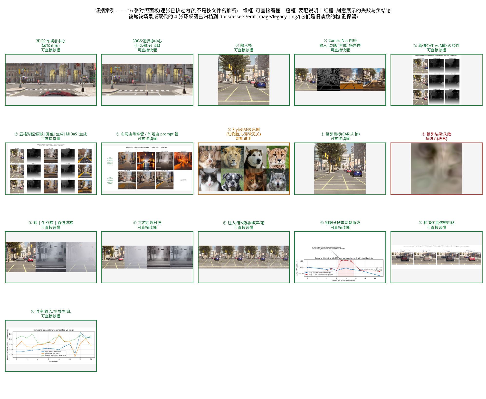

★ 标色依据是**我逐张看过的内容**,不是按文件名推断的:
**绿框 = 直接能看懂** / **橙框 = 要配说明**(视角非典型,或那张图的用途是佐证一条数字、不是好看) /
**红框 = 刻意展示的失败与负结论** —— `stylegan3_proj_result` 就是「官方权重域外、投影投不进去」的物证。

---

## 1 两个参考仓库的接入实测(2026-10-05)

> 两个 repo 克隆在 `hdMapGitHub/`(第三方内容,**不入库**);权重落在 `weights/`(不入库),
> 来源与 sha256 记在 `weights/*/MANIFEST.txt`。
> **用户授权**:2026-10-05 明确授权加载这两个官方源发布的权重
> (pkl / .pth 都是**可执行格式**,反序列化 = 在本机跑别人写的代码)。

### 1.0 三条环境事实(它们决定了后面所有做法)

| 事实 | 读数 | 后果 |
|---|---|---|
| **`huggingface.co` 不通** | HTTP 000 超时 | ControlNet 权重与 CLIP 文本塔必须走 **`HF_ENDPOINT=https://hf-mirror.com`**(实测 200 / 0.54 s) |
| **NGC 通** | `api.ngc.nvidia.com` 302 | StyleGAN3 官方权重可下 |
| **两个 repo 的 env 都是 2021 年的**(torch 1.9/1.12 + py3.8) | 本机只有 torch 2.6(cu124)/2.13(cu130) | **不新建 env** —— 两条链都在**现成的 `autodrivedata` env** 里跑通了(见 §1.1 / §1.2) |

### 1.1 StyleGAN3:跑通,且**不需要编它的 CUDA 扩展**

**权重**:`stylegan3-r-afhqv2-512x512.pkl`,249,525,556 B,
sha256 `77b9cd6bbaf0a2dfeb4372c9f86b7280a98f293aa1b9d35465864895596628c8`(NGC 官方源)。

**★ 关键判断:不碰 nvcc。**

`torch_utils/custom_ops.py:get_plugin` 编译失败时是 **`raise`**,而 `bias_act._init()` /
`filtered_lrelu._init()` **恒返回 `True`** ⇒ **编不过 = 硬崩,不会静默回退**。
但三个 op 都有 `impl='ref'` 的纯 PyTorch 实现,把 `_init` 改成 `return False` 就全部落到 ref 分支。

**这条决定是对的**,理由不是"ref 够快",是**避开了本仓踩过三次的 `.so` 覆盖坑**
([edit-3dgs-plan.md](edit-3dgs-plan.md) §A.4.0 / §C.0.1:CUDA_HOME 不同 ⇒ torch JIT 缓存 hash 不命中
⇒ **重编并静默覆盖**规范那份)。实测 ref 路径**根本不慢**,没必要冒那个险。

| 配置 | s/张 | 峰值显存 | 备注 |
|---|---|---|---|
| batch 1 | 0.93 | 2.32 GiB | |
| batch 2 | 0.42 | 4.57 GiB | |
| **batch 4** | **0.39** | **9.08 GiB** | ★ 上界 |
| batch 8 / 16 | **失败** | — | `RuntimeError: Expected canUse32BitIndexMath(...)` |

⚠️ **batch 上界 4 是 ref 实现的结构性上限**,不是显存不够:`_upfirdn2d_ref` 把 `(N·C)` 折成一个维度
做分组卷积,batch 一大就超过 2³¹ 个元素。**换 batch 就是换口径**,报数要写。

**成本与复现性**:

| 项 | 读数 |
|---|---|
| pkl 加载 | 1.1 s |
| `G_ema` | **16.7 M** 参数 / 512² / num_ws 16 |
| **同 seed 重跑 `max\|Δ\|`** | **0.000e+00 ⇒ 逐位相同** |
| 自证 | z 逐位相同 **且** 两次构造的权重逐位相同(否则那条 max\|Δ\| 读不出东西) |

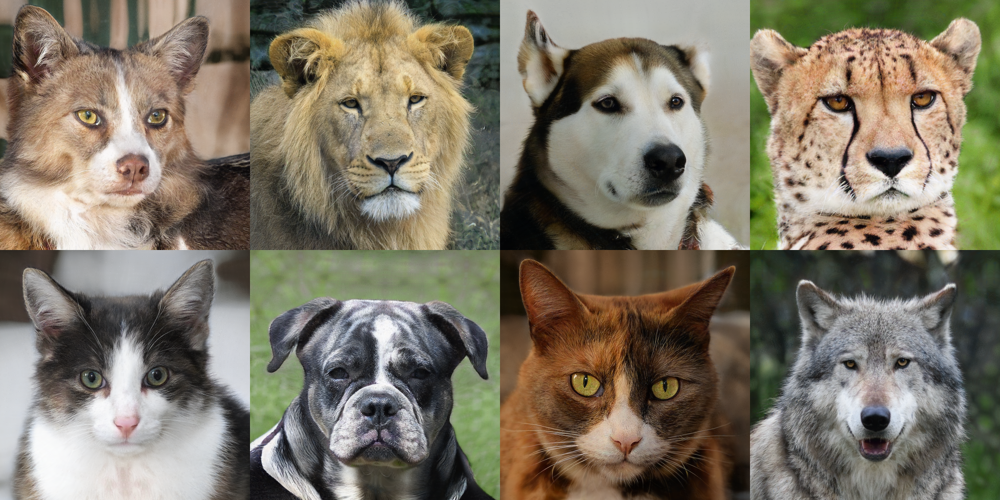

★ **这条比 3DGS 好一个量级**:3DGS 的 `--seed` **管不到 `atomicAdd` 的累加序**,
同 seed 重跑极差 0.08 dB([edit-3dgs-plan.md](edit-3dgs-plan.md) §A.3.6)。
⇒ **StyleGAN3 这条线的判据可以读到「逐位」**,而 3DGS 那条读不到。两个数**不许互相引用**。

**接线踩的坑(唯一一个)**:`conv2d_gradfix` / `grid_sample_gradfix` 顶层
`from pkg_resources import parse_version`,而本机 **setuptools 83 已删掉 `pkg_resources`**。
两处只用来比 torch 版本、且**仅训练需要** ⇒ 一个只补 `parse_version` 的模块替身即可。

⚠️ **顺带记一条会咬人的**:`custom_ops.py:91` **无条件**执行
`os.environ['TORCH_CUDA_ARCH_LIST'] = ''`。将来若真要编它的扩展,这条与本仓
`gs/cuda_env.py` 的纪律**直接冲突**(那个模块的存在就是为了钉住这两个环境变量)。

### 1.2 ControlNet:跑通,**且目检确认它在做结构可控的生成**(canny 变体)

**权重**:`models/control_sd15_canny.pth`,5,710,753,329 B,
sha256 `4de384b16bc2d7a1fb258ca0cbd941d7dd0a721ae996aff89f905299d6923f45`(HF `lllyasviel/ControlNet`,官方源)。

**依赖只加了 6 个包,torch/numpy/transformers/PIL/cv2 一个没动**
(装前 `pip install --dry-run --report` 验过):`omegaconf 2.3.1` / `open_clip_torch 3.3.0` /
`einops 0.8.2` / `timm 1.0.30` / `pytorch_lightning 2.6.6` / `ftfy 6.3.1`。
`cldm` 与 `ldm` **在 repo 内自带**,不需要 pip 装 stable-diffusion。

**四处版本适配 —— 每一处都"报错指不到真因",逐个留痕**:

| # | 现象 | 真因 |
|---|---|---|
| 1 | `No module named 'pytorch_lightning'` | `cldm.cldm` → `ldm.models.diffusion.ddpm` → `import pytorch_lightning`。**单文件 AST 扫描漏了传递链**(同本仓「惰性 import 逃过 `--collect-only`」那条) |
| 2 | `No module named 'pytorch_lightning.utilities.distributed'` | PL 2.x 把它挪到 `.utilities.rank_zero`。推理链上只用到 `rank_zero_only` 一个符号 ⇒ **模块 shim,不降级 PL**(降级会动到本 env 里别的东西) |
| 3 | `UnpicklingError`(预期内) | **torch 2.6 的 `torch.load` 默认 `weights_only=True`**,而这份 2021 年的 ckpt 里带 omegaconf 对象 ⇒ 显式放开(等价于"反序列化这个文件",正是被授权的那件事) |
| 4 | ★ `Error(s) in loading state_dict`:模型缺 `cond_stage_model.transformer.final_layer_norm.*`,ckpt 多 `...transformer.text_model.*` | **CLIP 文本塔的包装层被上游改了**:2021 年的 ckpt 带 `text_model.` 前缀,本机 `transformers` 的 `CLIPTextModel` 键是**裸的**(196 个键,`embeddings.*` / `encoder.*` / `final_layer_norm.*`)。修法 = **196 个键重映射 + 丢 1 个 `position_ids` buffer**(老版注册成 buffer、新版删了,不是参数) |
| 5 | `RuntimeError: size of tensor a (64) must match tensor b (208)`(在 `h += guided_hint`) | ★ **喂进去的不是方图**:`resize_image` 按**长边**缩,而本项目的采集帧是 1242×375 ⇒ 缩完 512×**154**;latent 是 64×64。官方 demo 假定输入是方图(Gradio 画布产出的就是方的)⇒ **必须先中心方裁**。报错只说形状不匹配,**没说"你喂了张长条图"** |

**成本**:

| 项 | 读数 |
|---|---|
| `create_model` | 1428 M 参数 / 11.2 s(CLIP 已缓存后) |
| 权重加载 | 8.4 s,**10.70 GiB** |
| 采样(20 步 DDIM,bs=2)| **8.1 s**,峰值 **12.85 GiB** |

**★ 可控性判据 —— 有对照,才读得出来**:同一个 prompt、同一个 seed,
**A 臂**用该图自己的 canny,**B 臂**用**另一张图**的 canny;
读数 = 生成图自身的 canny 与**该臂输入条件图**的边缘 IoU。

| 帧 | 与自己条件 | 与对方条件 |
|---|---|---|
| 000000 | **0.1309 / 0.1434** | 0.1031 / 0.1156 |
| 000030 | **0.1442 / 0.1537** | 0.0921 / 0.1025 |

四条全中、方向一致,但**分离度只有 1.3–1.6×** —— **就这个量而言,置信度不高**
(生成图自身边缘多,IoU 这个读数本来就钝)。

★ **所以真正的判据是目检**:

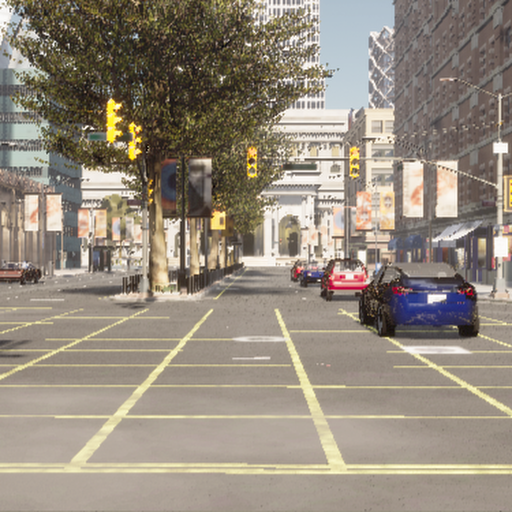

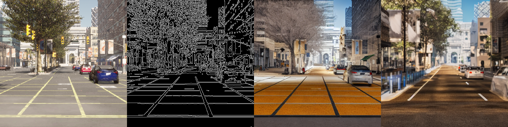

**输入帧 | 其 canny 条件 | 用它生成 | 用另一张条件生成** ——
第 3 格生成的街道**结构明显跟随输入帧**(建筑轮廓、路、树都对得上),第 4 格换成另一条街。
⇒ **结论不建立在 IoU 上,建立在"换条件换布局"这件事本身**。

---

### 1.3 ★★ depth 变体:真值条件 vs 官方估计器 —— **这是本轮最实的一个结论**

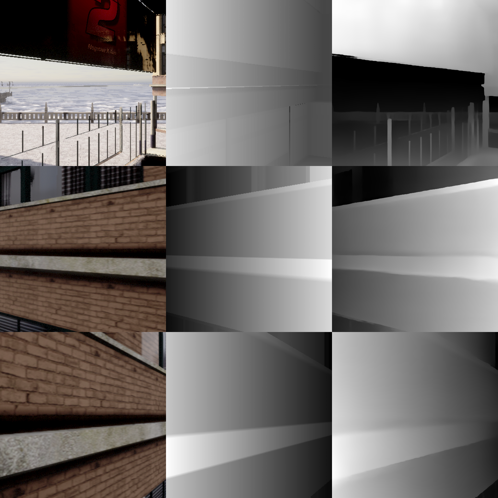

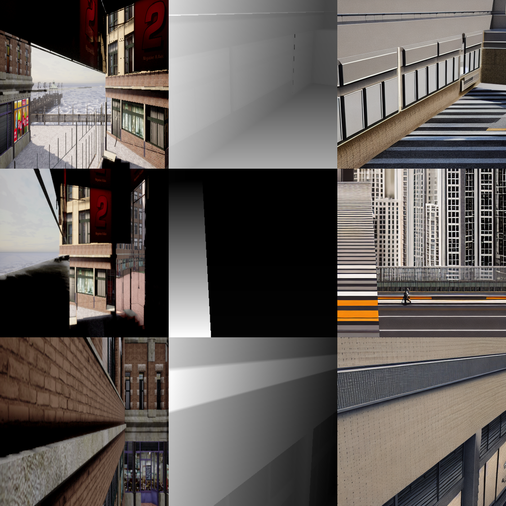

⚠️ **这两张图不好读** —— 它们跑在 `outputs/3dgs_sync` 那个**非典型视角**上(相机对着建筑外墙与天空),没有旁白看不出在讲什么。它们服务的是下面那条**数字**结论(条件保真度余量),不是「好不好看」。**可读的版本见 §1.5 的驾驶场景面板。**

**为什么先做 depth 不做 seg**(2026-10-05 裁决):
① `seg` 要造一张 **CARLA `CityObjectLabel` → ADE20K 150 类调色板**的映射,那是**人为约定**、无从验证;
② `depth` 的换算是**可验证的**(与 MiDaS 对表);
③ ★ **只有 depth 能把「布局」与「外观」分开** —— canny 依赖纹理与光照,**天气一变 canny 就变**,
而 JD 要的正是"按天气/时段变异**而布局不变**"。

**新增权重**(各 5.71 GB / 470 MB,均已校验):

| 文件 | sha256(前 12) |
|---|---|
| `control_sd15_depth.pth` | `726cd0b472c4` |
| `dpt_hybrid-midas-501f0c75.pt`(官方估计器) | `501f0c75b3bc` |

**换算式**(对齐 `annotator/midas/__init__.py:MidasDetector.__call__` 的三步):
真值深度的**唯一补充**是 `disparity = 1/depth`,其余(`逐图 min-max` → `×255 uint8`,白 = 近)逐字相同。

**判据 = 条件保真度 + 对照臂**:把生成图**重新过一遍 MiDaS** 得到它的深度条件,
与**输入条件**算 Spearman(**自比**);再与**另一帧的条件**算(**对照**)。
⇒ **可读的是余量,不是自比那个绝对值**(生成图天然都是街景,任何两张深度图本来就有相关性)。

| 帧 | 臂 | 自比 ρ | 对照 ρ | **余量** |
|---|---|---|---|---|
| 0 | 真值 min-max | 0.9572 | 0.7380 | **+0.2192** |
| 0 | 真值 histeq | 0.9897 | 0.7785 | +0.2112 |
| 0 | **MiDaS 估计** | 0.9135 | 0.8613 | **+0.0521** |
| 10 | 真值 min-max | 0.7954 | 0.4692 | **+0.3262** |
| 10 | 真值 histeq | 0.9434 | 0.6894 | +0.2540 |
| 10 | **MiDaS 估计** | 0.8577 | 0.7011 | **+0.1565** |
| 45 | 真值 min-max | 0.9880 | 0.7733 | **+0.2148** |
| 45 | 真值 histeq | 0.9869 | 0.7820 | +0.2049 |
| 45 | **MiDaS 估计** | 0.3385 | 0.3219 | **+0.0167** |

★★ **真值条件在余量上全面胜过 MiDaS 估计:4.2× / 2.1× / 12.8×**(三条全中、方向一致)。
**⇒ §2.1 那个"唯一站得住的差异点"在这里拿到了实测支持**:用真值深度当条件,
**条件进得比官方估计器更深**。fid 45 上 MiDaS 几乎没起作用(余量 +0.017)。

⚠️ **口径必须随读数一起报**:20 步 DDIM / guidance 9.0 / seed 42 / 每帧 2 张 / 512² /
单次生成 7.7–8.1 s / 峰值 10.70 GiB。**n = 3 帧**,是**机制验证**不是分布读数。

**目检**(行 = fid 0/10/45;列 = CARLA 原帧 | 真值条件 | **真值生成** | MiDaS 条件 | **MiDaS 生成**):

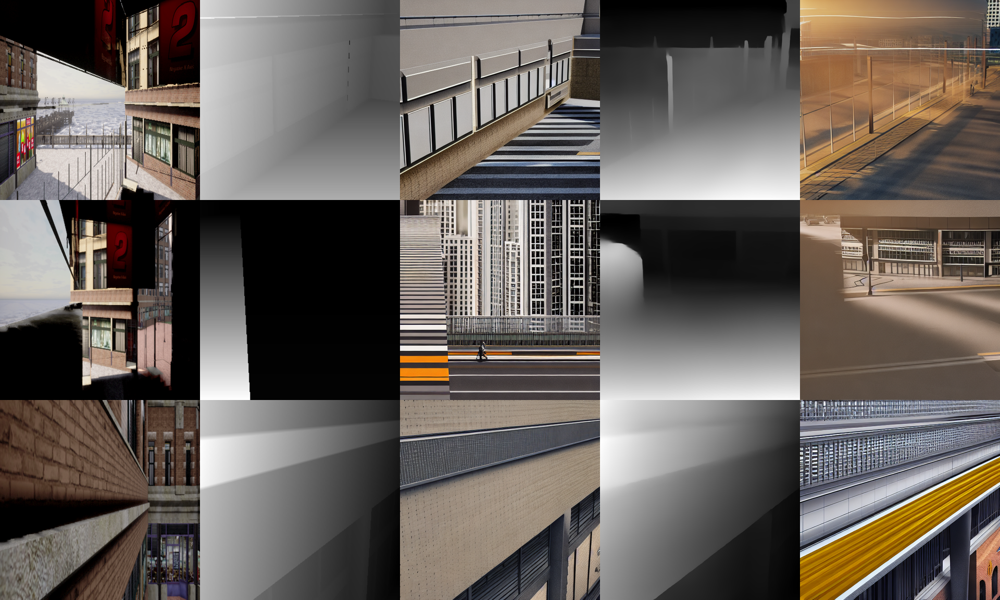

fid 45 那一行最干净:**真值条件是一条强的带状透视 → 生成的是同视角的墙**;
而 MiDaS 那条生成的是**另一个场景**。这与余量 0.215 vs 0.017 对得上。

#### ★★ 2026-10-06:换到驾驶场景重做一遍 —— **方向还在,量级不成立**

把同一套测量搬到 **`outputs/edit_p1/clear35`**(P1 那条直行街景,512²、带真值深度),
`--layout kitti`,跑两个帧组各 3 帧:

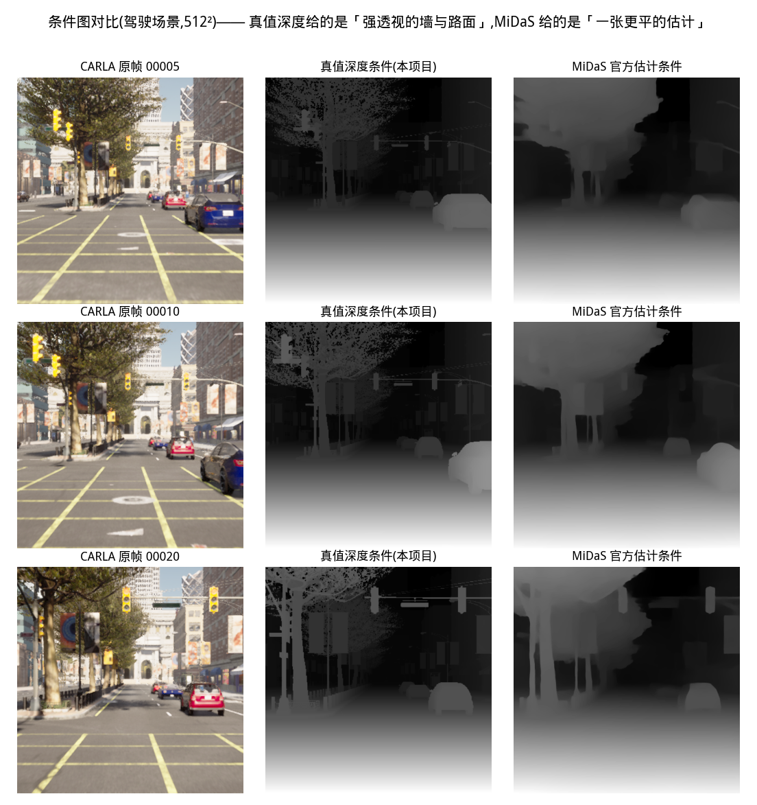

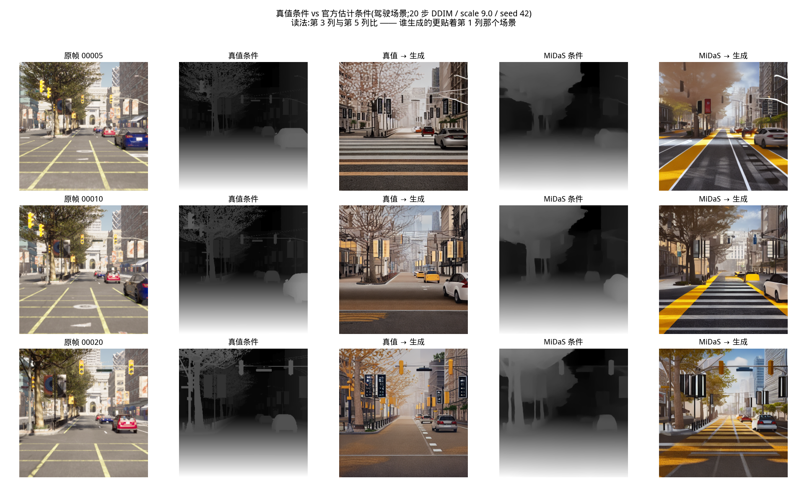

| 帧 | 真值余量 | MiDaS 余量 | 谁赢 |
|---|---|---|---|
| 5 | +0.0274 | +0.0231 | 真值 **1.19×** |
| 10 | +0.0341 | +0.0227 | 真值 **1.50×** |
| 20 | +0.0673 | +0.0653 | 真值 **1.03×** |
| 0 | +0.0101 | +0.0675 | ⚠ **MiDaS 6.7×** |
| 17 | +0.0634 | +0.0413 | 真值 **1.53×** |
| 34 | +0.0686 | **−0.0099** | 真值(MiDaS 为负) |

★★★ **两条要一起读**:
① **方向还在** —— 6 帧里 **5 帧真值胜**,且与环采那三条的**方向一致**;
② ⚠️ **但量级从 4.2–12.8× 掉到 1.0–1.5×**,第 0 帧还反过来。
⇒ **上面那张「4.2× / 2.1× / 12.8×」是那份环采数据上的读数,不许跨场景引用。**

**为什么**:这条判据读的是**余量 = 自比 − 对照**,而驾驶场景的**对照 ρ 高得多**
(0.88–0.95 vs 环采的 0.47–0.78)—— 街景帧间本来就长得像,判据的可达余量被压掉。
⇒ **这份判据需要「条件之间真的不同」才有分辨力**;慢速直行的街景**不是它的用武之地**。

⚠️ 所以两张新图是**目检用**,不是那两个数的新证据:它们让「真值条件长什么样、MiDaS 长什么样、
各自生成出什么」变成一眼能看的东西 —— 而那正是这两张图**原来做不到**的
(旧版跑在 `3dgs_sync` 的环形采集上,相机对着建筑外墙与天空)。

#### 1.3.1 ★ 三条判据边界(不写清就会误读)

**① 整图 Spearman 被"共享先验"撑满。** 环形采集每帧都是"下近上远",
实测**跨帧对照 0.9633 > 同帧 0.0360** —— 一个**没有判别力**的读数。
⇒ 要读横向结构必须先**减掉逐行均值**(去趋势)。

**② ρ 看不见条件的强度分布**(最阴的一条)。min-max 与秩等化**保序** ⇒ 与任何参考图的 ρ
几乎相同(实测 0.00335 vs 0.00327),**而分布差几倍**。真值条件被 `1/d` 挤在 **131–227 的窄带**
(发灰平场),MiDaS 铺满 0–255 —— **ControlNet 吃的是像素值不是排序**,一张 OOD 的条件图
而 ρ 一路正常。⇒ 加了 `--normalize {minmax,histeq,match}`(三者保序,只换分布)。

**③ MiDaS 本身在 512² 中心裁上不稳定。** 同一换算下逐帧 ρ 从 **−0.36 到 0.993**,
且由**场景深度范围**决定(0.7–21 m 近景帧 ρ≈0.9;3–82 m 远景帧 ρ≈0.03)。
⇒ **MiDaS 不能当"标准答案"** —— 它是官方 demo 的选择,不是可依赖的参照系。
(顺带更正一条我自己的错读:**换单调映射改不了任何 ρ** —— 实测 `1/d` / `1/sqrt(d)` / `1/d²` /
`-log(d)` 四个映射**逐帧给出完全相同的 ρ**,因为 Spearman 对单调变换不变。
表里只有 `-log(d)/d` 不同,**因为它是非单调的**。)

**⇒ 三条合起来**:这条线上"ρ 高"**既不充分也不必要**。所以 §1.3 的主判据用的是**余量**
(自比 − 对照),不是任何单点 ρ。

### 1.4 代码落点:`autodrivedata/edit/`(2026-10-05 用户裁决"成项目模块")

新能力面目录,层规则 **`_TORCH_OK`**(要 torch,**禁 carla** —— 条件源吃的是盘上已采好的数据)。

| 模块 | 职责 |
|---|---|
| `cldm_backend.py` | ControlNet 官方 repo 的**唯一落点**:6 处版本适配 + 权重 sha256 校验 + 两个官方条件估计器。**不在 `hdMapGitHub/` 里改一行** |
| `depth_cond.py` | **纯值**:度量深度 → 条件图(`1/d` + 三种保序归一化) + Spearman 判据 |
| `conditioned_gen.py` | CLI:条件源组装 → 生成 → **条件保真度(带对照臂)** |

**6 处适配**(每一处都"报错指不到真因",详录在 `cldm_backend` 头注):
① 传递 import 要 `pytorch_lightning` ② PL 2.x 挪走 `rank_zero_only` ③ torch 2.6 的 `weights_only`
④ CLIP 文本塔 196 键前缀 ⑤ 官方 demo 隐含要求**方图** ⑥ `MidasDetector` **自己不 resize**
(喂 375² 会在 ViT 里报 `a (577) must match b (530)`)。
外加第 ⑦ 条**我自己踩的**:hint 必须 **3 通道**(官方靠 `HWC3()` 复制),漏了会在
`openaimodel.py` 深处报 `expected input[2, 1, 512, 512] to have 3 channels`。

**判据 130 条**(`tests/edit/` 三个文件),其中**反向自证 9 条**,最关键的四条:
- 条件图方向反了(`1/d` 漏掉)⇒ 与正确的 Spearman **必须 ≈ −1**(实测 −0.988,uint8 并列所致)
- CLIP 缺键**必须抛** —— 宽松加载会把缺的键当随机初始化,**模型照样出图**,CLIP 那一半是白噪声
- 权重 sha256 对不上**必须抛**,而边车的 `(size, mtime)` 边界**明写成测试**(防的是下载坏,不是篡改)
- 三个条件源**尺寸必须都是 `COND_OUT`** —— 不齐会让保真度判据抛,或被"顺手 resize"糊过去

### 1.5 ★★ 阶段 F:**布局由条件管,外观由 prompt 管** —— JD 那句话的直接答案

JD 要的是「按需生成不同天气、时段、路况」而**布局不变**。设计是一个 **2×2**:

- **S 组** = **固定同一帧的条件**(fid 45) × **四个天气 prompt**
- **D 组** = **固定同一 prompt** × **三个不同帧的条件**

判据 = 生成图的**结构描述子**(再过一遍 MiDaS 得到的深度条件)的组内两两 Spearman;
另给一个**外观**描述子(全图亮度的极差)。

| 组 | 组内结构相关(中位) | 亮度极差(外观变没变) |
|---|---|---|
| **S**:同条件 × 换 prompt | **+0.9861**(6 对全在 0.967–0.996) | **22.0** |
| **D**:同 prompt × 换条件 | **+0.5675** | **1.6** |
| **余量** | **+0.4186** | **13.7×** |

★★ **两个方向都成立**:换 prompt 时**结构几乎不动**(0.986)而**外观大变**(22.0);
换条件时**结构明显变**(0.568)而**外观不变**(1.6)。

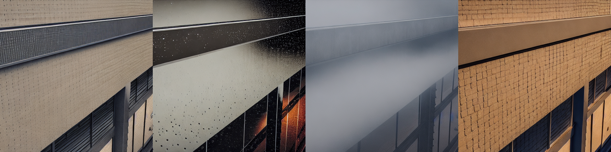

左→右:day / night-rain / dense-fog / sunset —— **同一栋楼的同一个透视**,外观全变。

#### ★★ 2026-10-06:驾驶场景重做 —— **复现**(而且顺手抓到两个坑)

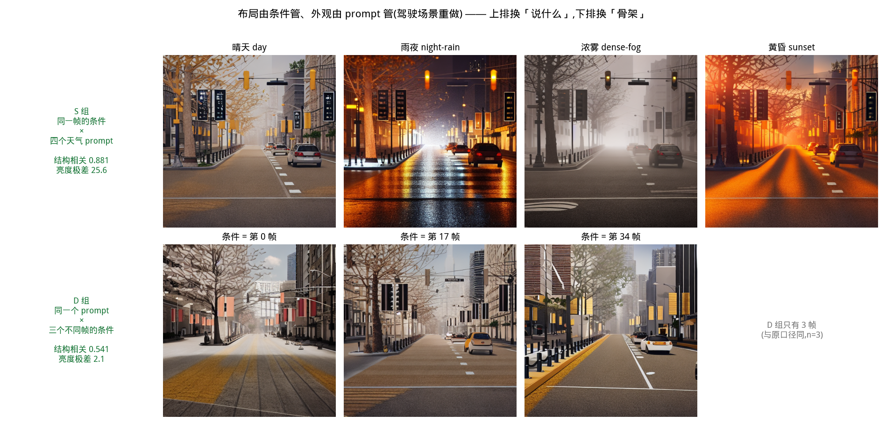

| 组 | 环采(原读数) | **驾驶场景(重做)** |
|---|---|---|
| **S** 同条件 × 换 prompt | 0.9861 | **0.8813** |
| **D** 同 prompt × 换条件 | 0.5675 | **0.5411** |
| **结构余量** | +0.4186 | **+0.3401** |
| **外观比** | 13.7× | **12.2×** |

⇒ **两个方向都复现**(余量同档、外观比同档)。**这条是 §1 里最稳的一条结论。**

⚠️ **但必须去趋势**(§1.3.1 ① 早就写了):未去趋势时 S=0.961 / D=**0.932**,余量只剩 **+0.029** ——
"D 组换条件"几乎没被测到。**那是「下近上远」这个共享先验撑满整图 Spearman 的读数**,
不是"条件不管布局"。⇒ **凡读结构相关,先减掉逐行均值。**

⚠️★ **第二个坑(我自己踩的)**:第一版 D 组取了帧 5/10/20 —— 它们只差 4~8 m,
**布局本来就一样**,于是 D 自己就 0.92,等于**没测"换条件"这件事**。
改用跨全程序列的 0/17/34(差 ~27 m)才测到。⇒ **D 组的帧必须真的不同,这不是调参是前提。**

⚠️ **口径**:20 步 DDIM / guidance 9.0 / seed 42 / 512² / 单张 4.8 s;n = 4 与 3 ⇒
**机制验证,不是分布读数**。⚠️ 结构描述子只测**几何**层面;"外观"只用了亮度——
两个都是**代理**,不是"和谐化"那个意义上的真实感判据(见 §3 阶段 G)。

### 1.6 ★★★ 下游闭环:**「生成的退化」vs「真值的退化」**(2026-10-06,本轮最重的一条)

JD 那句「**确保仿真数据可用于感知模型训练**」的可测形式 = **同一套 GT 配上不同来源的退化图,
看检测器掉多少**。为此先补了**数据源**:现有 root 里**没有一份同时有 `label_2` 与真值深度**
(`kitti_ab_*` 有框没深度、`3dgs_sync/capture` 有深度没框)⇒ 给 `collect_ab_route` 加了 `--depth`。

**新增模块**:`edit/kitti_square.py`(KITTI root → 方裁 root,纯值)、
`edit/downstream_eval.py`(四臂编排 + 裁决)。

#### 四臂(同一后端 SAM3 / 同一次会话 / conf=0.5 / IoU@0.5,**35 帧**)

| 臂 | image_2 | 天空带亮度 | **mAP** | 召回 | 检出/GT |
|---|---|---|---|---|---|
| **A** clear | 真值晴天方裁帧 | 119 | 0.788 | 0.840 | 1.12 |
| **B** truth-fog | 真值浓雾帧 | **196** | **0.618**(Δ **−0.170**) | 0.689 | 0.79 |
| **C** gen-fog(弱 prompt) | 生成雾 | 126 | 0.796(Δ **+0.008**) | 0.840 | 1.01 |
| **C′** gen-fog(**强化 prompt**) | 生成雾 | **156** | 0.798(Δ **+0.010**) | 0.815 | 0.98 |
| **D** 对照 | **后半程**的生成图 | 152 | **0.359**(Δ **−0.429**) | 0.370 | 0.42 |

★ **三档单调序 ⇒ 尺子有效**:地板 **−0.429** ≪ 真值雾 **−0.170** ≪ 生成雾 **+0.010**。
★ D 臂是判据的**分辨力来源**:没有它,就分不清"生成掉点"与"图与 GT 本来就对不上"。

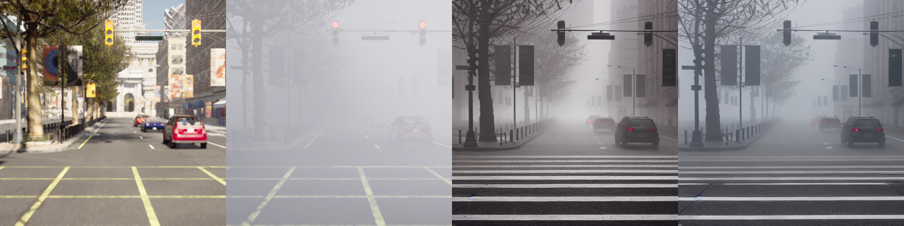

#### ★★ 结论:生成"退化"**不能替代**真值退化 —— 而且原因是**结构性的**

把 prompt 从 `dense fog` 强化到 `thick heavy fog / whiteout / visibility under 10 m`,
**天空带亮度从 +8.6 涨到 +33.2**(真值雾是 **+90.7**)—— **亮度走了一半以上,AP 却完全不掉**。

**目检给出了机制**([assets/edit-image/fog_truth_vs_gen.png](assets/edit-image/fog_truth_vs_gen.png),左→右:真值晴天 | 生成雾 | 真值浓雾):

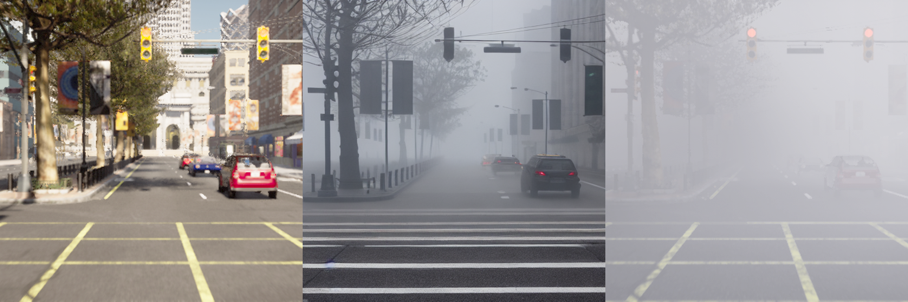

**真值的雾把物体本身吞掉**(右图那台红车几乎看不见),而**生成的雾是叠在清晰物体上的一层薄雾**。

> ★★★ **这不是 prompt 调参问题,是这条路线的结构性张力**:
> **条件(真值深度)要求模型在指定距离上画出一个物体 ⇒ 那个物体就必然是清晰的**
> ⇒ **布局锚得越死,被退化的物体就越保住了可检测性**。
> **"看起来像雾"(亮度统计)与"真的降低可见度"(检测器掉点)是两件事。**

> ⚠️⚠️ **2026-10-06 晚修订(#13 收口)**:上面这段里"**AP 完全不掉**"这一半**不成立** ——
> 那是 **11 点 AP 的台阶**造成的假象。同一批图在细口径下掉 **−0.062**(真值雾 −0.209),
> 操作点召回也掉了 **−0.076**(真值雾 −0.210)⇒ **生成雾 ≈ 真值雾的 1/3,不是 0**。
> **结构性的那一半(条件把物体画清楚 ⇒ 可检测性被保住)在"为什么只有 1/3"上仍然成立**,
> 但"完全没掉点"这个措辞作废。详见 **§1.10**。

#### ⚠️⚠️ 但上一条归因**被 P2 的注入曲线砍掉了一半**(2026-10-06 当晚,同一批 35 帧)

`edit/noise_curve` 在**同一批帧**上注入三种人工退化(运动模糊 / 高斯噪声 / 雨痕),
每种三档 —— 目检确认**注入确实生效**(blur=15 把车糊成一条、noise=50 满屏颗粒):

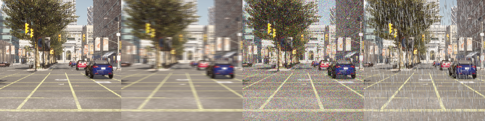

| 注入 | 档位 | **ΔAP** | 检出 | 召回 |
|---|---|---|---|---|
| 基线 | — | — | 133 | 0.840 |
| **blur** | 3 / 7 / **15** | +0.007 / +0.006 / **+0.011** | 133 / 132 / 131 | 0.849 / 0.866 / 0.874 |
| **noise** | 10 / 25 / 50 | −0.005 / −0.002 / −0.006 | 133 / 134 / 128 | 0.857 / 0.857 / 0.866 |
| **rain** | 200 / 800 / 2000 | +0.003 / −0.003 / −0.001 | 137 / 135 / 128 | 0.849 / 0.849 / 0.832 |

**★★ 全部落在 ±0.011,连 15 像素的水平运动模糊都不掉点。**
(对照:真值浓雾 **−0.170**、检出 **133 → 94**、亮度 **119 → 196**。)

⇒ **两件事必须分开写**:
1. **生成雾确实没达到真值雾的"全局信息湮灭"程度**(亮度 156 vs 196、物体边缘锐利)—— 这一半成立;
2. ★ **但"AP 掉多少"这条路本身对本类编辑极钝** —— **把物体糊掉 SAM3 照样认得出**。
   ⇒ 所以§1.6 原来的收尾句「布局锚得越死 ⇒ 越保住可检测性」**只对了一半**:
   另一半是**检测器自己的鲁棒性**,它与"生成得像不像"无关。

★ **这是本仓 §P-V24 那条教训的第二次现形**(「AP 在 recall 饱和时对退化不敏感,
要补操作点上的检出/召回」)—— **这里连检出/召回都不动**,钝得更彻底。
**⇒ 判据要换**:`SAM3 mAP` 不足以量"编辑后的可用性";要量,得换
① **更弱的检测器**(yolo 闭集是小目标/低对比的老痛点),或 ② **不用检测器**(如深度/几何一致性)。

⚠️ 因此 `noise_curve` 作为"标尺"**在本后端上立不起来** —— 它给不出单调曲线,
而"落不上曲线"这条判据**随之失效**(连基线都落不上)。工具留着,**换后端再跑才有意义**。

⚠️ **边界**:35 帧、单场景、单后端(SAM3,过检 1.12×GT)、`conf=0.5`。
中心方裁付出 **13/183 条 GT(7.1%)** 的代价、另 30% 被裁断。

### 1.7 P2:泛化谱的第二格 —— **路况**(wet_road)+ 注入曲线收口

`collect_ab_route --scene wet_road --depth` 重采(方裁后 **115/55/13,与 day_clear 逐项相同** ⇒ GT 相等):

| 臂 | mAP | 检出 | 召回 | 天空带亮度 |
|---|---|---|---|---|
| A clear | 0.788 | 133 | 0.840 | 119 |
| B **真值**湿路面 | 0.775(Δ **−0.013**) | 134 | 0.832 | 110 |
| C **生成**湿路面 | 0.784(Δ **−0.004**) | 134 | 0.832 | 137 |
| D 对照 | 0.364(Δ −0.424) | 63 | 0.395 | 138 |

★ **与归档交叉验证**:本仓记的 SAM3 口径湿路面 ΔAP **−0.014**,本次独立重采+重跑得 **−0.013** —— 对得上。

★★ **但这条读数本身没有意义**:**真值湿路面也只掉 0.013** ⇒ 这条退化在这个后端下**本来就没有信号**,
"生成 vs 真值"两边都落在判据分辨率(±0.02)之内。**⇒ 判据对这一格不适用,不是"生成得不好"。**

#### ★★★ 三条线合起来收口(§1.6 生成雾 + 本节湿路面 + 注入曲线)

| 退化 | 亮度变化 | ΔAP | 检出 |
|---|---|---|---|
| 真值**浓雾** | 119 → **196**(白化) | **−0.170** | 133 → 94 |
| 真值湿路面 | 119 → 110 | −0.013 | 134 |
| 人工 **blur=15** | 119(不变) | +0.011 | 131 |
| 人工 noise/rain | 119 | ±0.006 | 128–137 |
| 生成浓雾(强化 prompt) | 119 → 156 | +0.010 | 117 |

> **能移动 SAM3 的只有「把画面白化到失去信息」这一类。**
> 局部/结构性的退化(模糊、噪声、雨痕、湿路面)**全都不动** —— 包括把车糊成一条的 15 px 模糊。

**⇒ 这解释并限定了 §1.6**:那里说的"布局锚得越死 ⇒ 越保住可检测性"**只对了一半**;
另一半是**检测器自身的鲁棒性**,它与"生成得像不像"无关
(真值湿路面同样掉不动、人工模糊同样掉不动)。

#### ★★★ `--backend yolo` 复验(2026-10-06 当晚,同一批 35 帧)—— **答案一半,又挖出一个判据困境**

**注入曲线(yolo,基线 mAP = 0.1818)**:

| 注入 | 档位 | ΔAP |
|---|---|---|
| blur | 3 / 7 / 15 | +0.091 / **−0.091** / **−0.091** |
| noise | 10 / 25 / 50 | **−0.182 / −0.182 / −0.182**(掉到 0.000) |
| rain | 200 / 800 / 2000 | −0.091 / −0.091 / −0.182 |

**⇒ 回答了一半**:yolo **确实动**(noise 直接全灭),而 SAM3 **全部不动**(±0.011)。
⇒ **§1.7 那条"SAM3 钝"至少有一部分是后端性质,不是数据的性质。**

**★ 但 yolo 这条曲线本身也没有分辨力,而真因是方裁**:
它的基线 mAP 只有 **0.1818**(归档里**原画幅**的 yolo 基线是 **0.669**),
而 AP 只落在 `0 / 0.0909 / 0.1818 / 0.2727` 上 —— **量化到 11 档**。
KITTI 微调的 yolo 是按**原画幅焦距/尺度**训的;把 1242→375 中心裁掉 **3.3× 尺度**,它先就废了。

**⇒ 这是一个结构性的判据困境,不是调参能解的**:

| | 要什么 | 冲突 |
|---|---|---|
| **生成管线** | **方图**(ControlNet 的官方前提) | 方裁把 yolo 的尺度先验打坏(0.669 → 0.182) |
| **KITTI 微调的检测器** | **原画幅** | 而那些帧不是方的 |

⇒ **两者不可兼得**。要真正判这一条,只有三条路:
① **换尺度鲁棒的检测器**(SAM3 就是,但它对这类退化太钝);
② **改生成管线让它出原画幅**(把条件 **letterbox** 到方形、生成后**反 letterbox**)——
   代价是条件图有一半是填充,而 ControlNet 训练分布里没有那种构图;
③ **改判据不用检测器**(几何/深度一致性那类)。

**⇒ 结论**:`SAM3 Δ mAP` 与 **KITTI** `yolo Δ mAP` **在本管线上都不是可用的判据** ——
前者太钝、后者被方裁打坏。

#### ★★★ 第三个后端(COCO 的 yolo26x)把判据修好了 —— **零代码改动**

`norm_cls` 里本来就有 `COCO_FALLBACK`(car/truck/bus/person/bicycle/motorcycle)⇒
**换一个权重就是一个新后端**:`--backend yolo --weight weights/yolo26x.pt`。

| 退化 | SAM3(基线 0.79) | KITTI-yolo(0.18,方裁废掉) | **COCO-yolo(0.80)** |
|---|---|---|---|
| 真值浓雾 | −0.170 | −0.182 | **−0.186** |
| 人工 rain=2000 | −0.001 | −0.182 | **−0.207**(曲线单调:−0.017/−0.039/−0.207) |
| 人工 noise=50 | −0.006 | −0.182 | −0.017 |
| **生成浓雾** | **+0.010** | +0.000 | **+0.003** |

★ `blur` 在 COCO 下仍不单调(−0.013 / +0.055 / −0.034)——**报数时不许只挑单调的那两条**。
★★ **两个结论因此判死**:① **SAM3 的"钝"是它自己的性质**(基础模型鲁棒),**不是方裁的错**;
② **生成侧"不掉点"在三个后端上完全一致** ⇒ **letterbox 那条路不必做了** —— 困境是换后端解开的。

> ⚠️⚠️ **2026-10-06 晚修订(§1.10)**:② 里"**不掉点**"这个词**作废** —— 它是 **11 点 AP 的台阶**
> 做出来的。同一批数据换 **101 点**口径:**COCO 的 Δ_gen 从 +0.003 变 −0.062**、
> **SAM3 从 +0.010 变 −0.014**。⇒ 正确的说法是「**三个后端一致地说生成雾比真值雾弱得多**
> (9%–30%),而不是"完全不掉"**」。而 ① 与「letterbox 不必做」**不受影响**。

#### ★★★ 机制:能移动检测器的**不是"雾有多白",是"退化是否随距离增长"**

同一条链上的**同一个合成雾模型**施在**真值图**与**生成图**上(35 帧,COCO 后端):

| 雾的类型 | 参数 | ΔAP(真值图) | ΔAP(生成图) |
|---|---|---|---|
| **全局遮蔽** `I'=(1−k)I+kA` | k = 0.2 / 0.4 / **0.6** | +0.000 / −0.001 / **−0.002** | −0.001 / −0.002 / **−0.001** |
| **距离相关** `I'=J·t+A(1−t)`,`t=e^(−βd)` | β = 0.02 / 0.05 / **0.10** | +0.002 / −0.003 / **−0.262** | +0.014 / −0.080 / **−0.348** |
| 真值**浓雾**(CARLA 渲染) | — | **−0.186** | — |

**★ 全局遮蔽把亮度做到 186(真值浓雾 196)也只掉 −0.002** ⇒ **亮度根本不是判据**。

★★★ **三条结论**:

1. **「距离相关」是杀伤力的唯一来源** —— 同一个项目里两种雾的对比本身就是判据;
2. ★★ **生成图对距离相关雾的反应**(*−0.348*)**比真值图还强**(−0.262)
   ⇒ **生成图里的物体完全可被退化** ⇒ **§1.6 那条"条件把物体锁死"的假设不成立**(推翻);
3. **真因**:prompt 改的是**全局外观**,而真值退化的杀伤力在**距离相关的对比度衰减**。

**★★ 而 `d` 正是本项目的真值深度** ⇒ **解法恰好落在本项目的强项上**:
`degrade --kinds fogdepth`(**用真值深度合成距离相关退化**),而不是靠 prompt 措辞。
⇒ **「靠 prompt 生成退化天气」不可行;「用真值深度做物理正确的退化」可行,且单调可控。**

#### ★★★ β 标定曲线 + 投影对表(§5 #12 完成)—— **配方本身**

细扫 β(COCO 后端,35 帧,`noise_curve --levels`),**两种底图各建一条**:

| β(1/m) | `t=e^(−βd)`@40m | ΔAP **真值图** | ΔAP **生成图** |
|---|---|---|---|
| 0.04 | 0.202 | +0.076 | −0.077 |
| 0.05 | 0.135 | −0.003 | −0.080 |
| 0.06 | 0.091 | −0.001 | **−0.168** |
| 0.07 | 0.061 | −0.085 | −0.258 |
| 0.09 | 0.027 | **−0.174** | **−0.346** |
| 0.10 | 0.018 | −0.262 | −0.348 |
| 0.12 | 0.008 | −0.353 | −0.350 |

**★ 投影对表(`noise_curve.fit_equivalent_level`)**:

> ⚠️⚠️ **下面这张表已被 §1.11 取代** —— 它建在 **11 点口径**的曲线上,而那条曲线
> **不单调**(`+0.0763 / −0.0026 / −0.0013`),用它内插没有意义。修正后的表(101 点)
> 见 **§1.11**:真值雾 **0.0823** / 生成雾 **0.0621**(比值 **75%**,不是 54%)。

| 要解释的退化 | 它的 ΔAP | ⇒ 等效 β |
|---|---|---|
| **真值浓雾(CARLA)** | −0.186 | **0.091**(真值底图)/ **0.062**(生成底图) |
| **prompt 生成的雾** | +0.003 | **0.049**(≈ 曲线最轻档,即"没有退化") |
| 人工 rain=2000 | −0.207 | 0.094 |

★★★ ~~**一句话的答案**:**prompt 生成雾的等效消光系数只有真值浓雾的 54%(0.049 vs 0.091)**,
而曲线在这段**极陡**(0.05→0.10 掉了 0.26)⇒ **"β 差一半"对应"掉点差两个数量级"**。~~
（**已作废** —— 两个 β 都被 11 点的台阶偏过,见 §1.11。）

⚠️⚠️ **一条必须写明的边界:标定曲线是「底图相关」的。** 同一个 β 在**生成图**上掉得更多
(β=0.09:−0.346 vs 真值图的 −0.174)。⇒ **强度必须按 ΔAP 标定,不能按 β 对标**;
换底图(不同的生成模型 / 不同的场景)要**重标一次**。

**⇒ 产线配方(可复用)**:

```bash
# ① 对**目标底图**建 β 曲线(一次,5–8 档)
python -m autodrivedata.edit.noise_curve --base <底图root> --work <落点> \
    --kinds fogdepth --levels "fogdepth=0.04,0.05,0.06,0.07,0.08,0.09,0.10" \
    --backend yolo --weight weights/yolo26x.pt
# ② 反查 β 使 Δ 匹配目标(真值退化的 Δ)—— `noise_curve.fit_equivalent_level(curve, -0.186)`
# ③ 施加
python -m autodrivedata.edit.degrade --src <底图root> --dst <产物> --kind fogdepth --level 0.062
#    ⚠️ `fogdepth` 需要 `training/depth/`(真值深度);`kitti_square` 会按同一仿射一起裁过来
```

---

### 1.8 P3:视频编辑 —— 时序一致性

`edit/video_edit.py`。逐帧用**真值深度条件**生成 16 帧(`3dgs_sync` p0,环形 4°/帧),
判据 = **相邻帧结构跳变**(无模型梯度描述子,`1 − Spearman`),**两条自证**都在。

| 序列 | 相邻跳变中位 |
|---|---|
| 输入(真值) | 0.4226 |
| **生成** | **0.6187** |
| 打乱(自证) | 0.8277 |


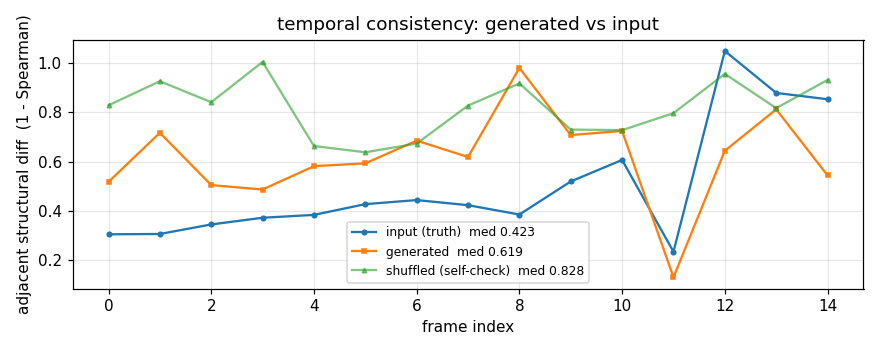

★ **读法必须诚实**:生成侧比真值序列 **高 46%**,而判据阈值是 50% —— **压线通过**。
⇒ 正确表述是「**没有"闪"到系统性失配的程度,但比真值序列抖**」,
**不许写成"时序一致"**(那会把 46% 的差吞掉)。

⚠️ **描述子刻意不用 MiDaS** —— 它自己就抖(§1.3.1 ③),**拿一把抖的尺子量抖,两者分不开**。
⚠️ 两侧**都必须先做中心方裁**再比:真值 1242×375、生成 512²,不裁比的是**构图**不是**结构**。

★ **这条对本项目有独特价值**:JD 说"视频编辑"而**本项目有帧间 GT 配对**(条件逐帧已知连续)——
是少见的"视频编辑**有真值**"的场景。

---

### 1.9 P4:和谐化 —— **先立靶**,方法只做基线

⚠️ **这一格没有真值靶**(生成整幅图没有"正确答案")⇒ 判据只能是**代理**。

- **靶** = 生成图与**真值帧**的 **LAB 一阶/二阶统计距离**(均值 = 光影/色温冲突;协方差 = 反差冲突)
- **方法**只做经典基线(`Reinhard` 颜色迁移)—— 它的用处是**证明尺子能测出已知的改善**
- **判据两条**:① 迁移后距离下降;② ★ **与「对齐到别的帧」的对照臂分得开**

| 读数 | 值 |
|---|---|
| 迁移前 | **1.6814** |
| 迁移后 | **0.0356**(降 **47×**) |
| 对照(对齐到别的帧) | 0.1830 |

⇒ **尺子可用**(改善与对照分开 **5.1×**),但**这只是代理** —— 不许报成"和谐化达标"。

> ★★ **2026-10-06 更新:真值靶找到了**(见 §**1.12**)—— 上面那句"这一格没有真值靶"**作废**。

★ 一处**真缺陷**(测试抓到的):OpenCV 的 LAB **有两套量纲**(uint8 → `L∈[0,255]`;float32 → `L∈[0,100]`),
混用会让 L 通道彻底错(实测输出 `L≈0.47` 而参考 `153.8`)。已把两侧口径收进 `to_lab`/`from_lab` 两个函数独占。

---

### 1.10 ★★★ 判据本身的分辨率:**11 点 AP 是台阶函数**(2026-10-06,§5 #13 收口)

§5 #13 原来记着一条"**未查因,不写成因**":`blur` 在 COCO 后端下**不单调**
(−0.013 / **+0.055** / −0.034)。查完了 —— 它**不是模糊的性质,是尺子的台阶**,
而它污染的不止这一条曲线:**它把 §1.6 的裁决改判了**。

#### 根因

`eval_2d_ab.ap_for` 是 **11 点插值**:recall 格点 `j/10`(j=0..10),格点 j 可达 ⟺
`n_tp ≥ T_j = ceil(j/10·n_gt)`。⇒ **`n_tp` 每跨过一个门槛,那一格的 precision 从 0 跳成正值**,
AP 跳 `p_j/11 ≤ 1/11 = 0.091`。

这批数据正好卡在上面:**35 帧、单类 Car、`n_gt = 119`** ⇒ 第 10 格(recall 0.90)的门槛是
**108**。基线 `tp = 106`(距上一格只剩 **2** 个 TP)。

#### 证据(三重,缺一条都可能是巧合)

① **逐档 `tp` 与格点同步**:`blur` 3→15 的 `tp` 是 `106/106/106/107/107/**108**/109/108/107/102`,
   而 AP 的凸起**恰好落在 tp ≥ 108 的那三档**(k=7/8/9);
② **换口径**:同一批检测用 **101 点**重算,`+0.055` → **−0.014**,凸起整体消失;
③ **逐条定位**:k=6→7 **只多了 1 条** TP(`conf 0.360`、`bestIoU **0.540**`,压在 0.5 上)。

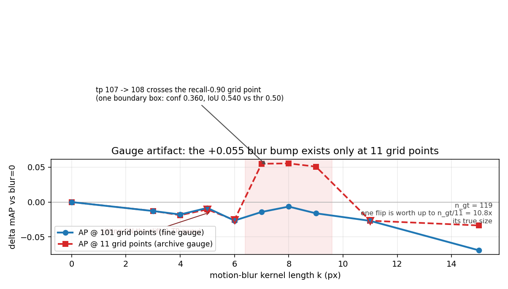

#### ★★ 放大倍数 = `n_gt/11`

同一个"边界检测翻面",在 11 点口径下值 `p/11`,而真实精度曲线在同一处只变化
`p/n_gt`(recall 轴挪了 `1/n_gt`)⇒ **放大 `n_gt/11` 倍**。`n_gt = 119` 时 = **10.8×**。
（有合成对照钉住:`tests/perception/test_eval_2d_ab.py::TestStepAmplification`
—— `n_gt=10` 时两把尺子一致、`n_gt=110` 时差 ~10×。）

#### ★★★ 它污染了什么:四臂重审(**同一个冻结 GT**,两个口径各算一遍)

| 臂 | ΔAP @11(归档口径) | **ΔAP @101(细口径)** | 操作点 tp/GT | 召回 |
|---|---|---|---|---|
| **A** clear(基线) | — | — | 106/119 | **0.891** |
| **B** 真值浓雾 | −0.1857 | **−0.2086** | 81/119 | 0.681 |
| **C** 生成浓雾 | **+0.0032** | **−0.0617** | 97/119 | 0.815 |
| **D** 对照(地板) | −0.4364 | **−0.4888** | 45/119 | 0.378 |

★ 差异的**来源是尾部折扣不对称**:`A_clear` 的 max recall 恰好 **0.891**,卡在 0.90 格点
**下方** ⇒ 它在 11 点口径下被整整扣掉一格(0.7977 vs 0.8607,差 **0.063**);
而 `C_gen_fog`(召回 0.815)两把尺子给的"可达权重"几乎一样(9/11 vs 82/101)。
⇒ **两臂拿到了不同的折扣**,一个 **−0.062 的真差被抹成 +0.003**。

#### ★★★ §1.6 的裁决因此改判

| | 11 点口径 | 101 点口径 |
|---|---|---|
| Δ 生成雾 | +0.003 | **−0.062** |
| 三档裁决 | 「**假退化**(生成根本没加雾)」 | 「**退化偏弱**(约 1/3 真值雾)」 |

#### ★★ 两个后端都重跑了一遍(同一批 35 帧,同一冻结 GT)

| 后端 | 基线 tp/GT | Δ 真值雾 @11 / **@101** | Δ 生成雾 @11 / **@101** | **生成 / 真值** |
|---|---|---|---|---|
| **COCO-yolo**(基线 AP 0.80) | 106/119(0.891) | −0.186 / **−0.209** | +0.003 / **−0.062** | **30%** |
| **SAM3**(基线 AP 0.79) | 100/119(0.840) | −0.170 / **−0.150** | +0.010 / **−0.014** | **9%** |

★ **两个后端方向一致、量级不同**:11 点口径下两边都读成"生成侧不掉点"(+0.003 / +0.010),
**细口径下两边都是负的**(−0.062 / −0.014)。⇒ **改判不是 COCO 的偶然**。

**第三条与口径无关的证据**:**操作点上的召回**(网格无关)—— A_clear **0.891** → C_gen_fog **0.815**
(**−0.076**),真值浓雾 → **0.681**(−0.210)⇒ **36%**;SAM3 那侧是 0.840 → 0.815 / 0.689 ⇒ **~17%**。
四个读数方向一致(细口径 AP 30% / 9%、召回 36% / 17%)。

⚠️ **一条不许混的**:§1.11 的 β 投影给出**75%**(等效消光系数之比),与这里的 30% **不矛盾** ——
`Δ(β)` 曲线**上凸**,同样的 β 往右挪一点掉点就差很多。**报哪个必须写清是"ΔAP 之比"还是"等效 β 之比"。**

⚠️ **改判的是"它有没有掉点",不是"它够不够用"。** 生成雾只有真值雾的 **1/10 ~ 1/3** ——
「**不能替代真值退化**」这个结论**不变**,变的是理由(不是"没加雾",是"加得不够")。

⚠️ **§1.7 那句「三个后端一致地说生成侧不掉点」作废**:一致的**方向**是
"生成雾比真值雾**弱得多**",而 11 点口径把它读成了"**完全不掉**"。
**报数必须写口径**(11 点 / 101 点)与**后端**。

#### ★ 一条纪律

**`ΔAP` 必须与 `n_tp/n_gt` 一起读。** `eval_2d_ab` 现在自己会喊:
`⚠ AP 是台阶函数(11 点 recall 格):Car 距上格 1 TP ⇒ 单条检测翻面即可换 ±0.091 AP`。
要**插值 / 拟合 / 投影**的用途一律走 `--grid-points 101`;归档口径仍是 11 点,
**两者不可混比**(`logs/*.json` 的 `highlights.grid_points` 是归属依据)。

---

### 1.11 ★★ β 标定自动化(`edit/calibrate`)—— §5 #14 收口

§1.7 留下的配方是**人工**三步(扫 → 看表内插 → 抄命令),而曲线**底图相关** ⇒
每换一个生成基底 / 条件源 / 场景都要重来。现在是一条命令,而且**口径也一并修对了**。

#### ★ 为什么标定**必须**用细口径(实测对照)

| 曲线 | 11 点 | **101 点** |
|---|---|---|
| 单调? | **False**(`+0.0763 / −0.0026 / −0.0013` —— 第二档比第三档低) | **True** |
| `β=0.04` 那一档 | Δ = **+0.0763**(比基线还好) | Δ = **+0.0102** |
| 用它内插 | 台阶被当成退化效应 | 可内插 |

⇒ **一条非单调的曲线做线性内插,结果是不可解释的** —— §1.7 那张旧投影表就是这么来的。
`edit/calibrate` 默认 `--grid-points 101`,并**自动报 `曲线单调 = True/False`**。

#### 修正后的投影表(全部 101 点口径、冻结 GT、COCO-yolo、35 帧)

| 要解释的退化 | ΔAP(101) | ⇒ 等效 β |
|---|---|---|
| 真值浓雾(CARLA 渲染) | **−0.2086** | **0.0823**(真值底图) |
| **prompt 生成的浓雾** | **−0.0617** | **0.0621** |
| 真值浓雾的 Δ 施加到**生成**底图 | −0.2086 | **0.0673** ← ★ 底图相关性的定量形态 |

★★★ **一句话**:**prompt 生成雾的等效消光系数是真值浓雾的 75%**(0.062 vs 0.082),
不是旧表的 54%(旧表那两个数都被台阶偏过)。而**同一个 Δ 要在生成底图上打出来只需 β 0.067
(真值底图的 82%)** ⇒ **强度必须按 ΔAP 标定,不能按 β 对标**。

⚠️ 这两条**不矛盾**:一个是"等效 β 之比"(75%),一个是"等效 Δ 之比"(30%)——
因为 `Δ(β)` 曲线**上凸**,同样的 β 往右挪一点,掉点就差很多。**报哪个必须写清**。

#### 产线配方(三步 → 一条命令)

```bash
# ①+② 扫曲线 + 拟合 + 出配方(--apply 还能直接落产物)
python -m autodrivedata.edit.calibrate \
    --base <目标底图root> --work <曲线落点> --kind fogdepth \
    --target-arms <参考root>:<退化root>     # 或 --target-delta <数值>
#   ⚠️ 要内插的 Δ 与建曲线的评测集必须是同一批 —— 没给 --frames 会在开跑时提醒
# ③ 产物(配方里已给成可粘贴的命令)
#   python -m autodrivedata.edit.degrade --src <底图> --dst <产物> --kind fogdepth --level 0.0823
```

#### 一次真实运行(两条底图各一遍)

| 底图 | 目标 Δ(101 点) | 曲线单调 | 拟合 β |
|---|---|---|---|
| 真值方裁(`clear35`) | −0.2086 | **True** | **0.0823** |
| 生成方裁(`clear35_gen`) | −0.2086 | **True** | **0.0673** |

（⚠️ 冻结 GT 之前跑的那一遍给 0.0846/目标 −0.2178;差别 0.009 见下。）

#### ⚠️ 顺带修掉的一处:`downstream_eval` 四臂原来**各带各的 GT**

`run_arms` 让 B 臂带 `fog` 自己的 `label_2`(其余三臂带 `clear` 的),理由是
"A/B 是同一批物体 ⇒ 逐条相同"。**实测不是**:

| 量 | 实测 |
|---|---|
| 条数 / 帧号 | **完全相等**(119 条、35 帧) |
| 2D 框(排序后) | 差 **≤ 0.78 px** |
| 3D 位置(排序后) | 差 **≤ 0.06 m**(正是 A/B 硬门槛 `≤0.07 m` 那一档) |
| **行序** | **不同**(CARLA `get_actors()` 跨采集不稳定)⇒ 逐行 zip 会误报"差 215 px",**必须按多重集比** |

那 0.78 px 足以让一条压在 `IoU=0.5` 上的检测翻面:同一份预测换一套 GT,101 点口径下
Δ 从 **−0.2178 变 −0.2086**(0.009)。⇒ 已改成**四臂共用 `clear` 那一套 GT**,
单变量只剩"图"。**这正是"以为它们一样"与"证明它们一样"的差别。**
⚠️ 这个 0.009 在 11 点口径下**看不见** —— 又一处"粗口径藏住的事"。

---

### 1.12 ★★★ 和谐化的**真值靶**(2026-10-06,§3 阶段 G 的触发条件达成)

§1.9 明写着"这一格**没有真值靶**",判据只能是代理;§3 阶段 G 的触发条件就是"找到真值靶"。
找到了,而且**只用本项目已有的东西**。

#### 靶是怎么造的:**A/B 同帧跨天气粘贴**

| 角色 | 是什么 |
|---|---|
| **背景 / 真值 Y** | A 天气(`day_clear`)的第 f 帧 |
| **补丁来源** | B 天气(`sunset_glare`)的**同一帧** |
| **合成图 X** | A 的帧,把 **GT 车辆框区域**换成 B 的同位置像素 ⇒ 一块**光照对不上**的补丁 |
| **掩膜 M** | A 那一帧的 GT 车辆框(并集) |

⇒ 判据 = **掩膜内** `d(和谐化(X), Y)` 必须下降,且与对照臂分得开。**这是精确真值,不是代理。**

★★ **粘得上去的依据可验**:A/B 硬门槛要求两侧逐帧位置差 ≤0.07 m,在图像上的直接后果是
**同一物体的框坐标几乎相等** —— 实测(`day_clear` vs `sunset_glare`,70 帧)
**中位 0.02 px、max 0.31 px**。`harmonize_target.box_shift` 就是这条判据,超 2 px **当场抛**。

#### 读数(40 帧,`day_clear` ← `sunset_glare`,COCO 无关的纯图像判据)

| 臂 | 掩膜内 LAB 统计距离(中位) |
|---|---|
| **合成图(未处理)** | 3.3128 |
| **方法(用本图上下文)** | **1.5385**(降 **2.2×**) |
| 对照·**错光源**(用 B 那张图的外圈) | 2.7054 |
| 对照·整图全局 Reinhard | 3.3496 |

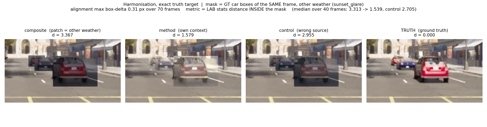

★ 两条都过:下降 **2.2×**,且与错误对照分开 **1.17**(≫ 容差 0.02)⇒ **"用对了上下文"这件事被证明了**,
不是"随便拉一把"。

★★★ **但残差很大,而那正是结论**:方法只做**一阶/二阶统计对齐**,不碰结构 ⇒
它修得了"光照/色温对不上",修不了**材质**。剩下的 **1.54** 就是**材质差本身** ——
一个真正要训练的 harmonization 网络,它的**有意义的目标就是这个残差**,而不是"从 3.31 降到多少"。

#### 边界(必须随读数一起报)

1. **掩膜是 GT 2D 框,不是紧致轮廓** —— 框里混着车周围的背景,那部分**也被换了**。
   任务因此是"把这一块补丁融进去";判据内部一致(框的像素是已知的);
2. **只在掩膜内比** —— 掩膜外两边逐位相同,算进去只会稀释信号;
3. **几何由 A/B 硬门槛保证** —— 换了没有帧级配对的场景,这个靶**造不出来**。

#### 两条自证(都在测试里)

- **管道自证**:补丁取自**真值那张图本身** ⇒ 合成图 == 真值 ⇒ `d_before` 必须是 **0**;
- **行序自证**:同一批框、**行序颠倒** ⇒ `box_shift` 必须是 **0**。
  ⚠️ 这条不是多余的:两家 root 的 `label_2` **行序真的不同**(CARLA `get_actors()` 跨采集不稳定),
  逐行 zip 会读出 "215 px" 的假错位,差一点被当成"两个采集位置不一样"(见 §1.11 末尾同一条)。

⚠️ **一处真缺陷(测试抓到的)**:第一版 `reinhard_transfer_masked` 把整幅 `from_lab(...)` 出去 ——
而 **RGB→LAB→RGB 有损**(量化 + 钳位)⇒ **掩膜外也被改了**,"只改掩膜内"这句话是假的。
现在只把掩膜内那批贴回去。

---

## 2 三条结构性发现

### 2.1 ★★ 本项目的独有件,**正好是 ControlNet 的条件源**

ControlNet 的 8 种条件里,本项目已经能出**真值**的有三种:

| ControlNet 条件 | 官方 demo 怎么拿 | **本项目怎么拿** |
|---|---|---|
| `canny` | 估计(cv2) | 估计(同上) |
| `depth` | 估计(MiDaS,`annotator/ckpts/dpt_hybrid-midas`) | **真值** —— `collect_3dgs` 的 `depth/*.npy`(CARLA `sensor.camera.depth`) |
| `seg` | 估计(Uniformer ADE20K) | **真值** —— `collect_surround --sem`/`collect_3dgs --sem`(`CityObjectLabel` tag 图) |
| `normal` / `mlsd` / `openpose` / `scribble` | 估计 | 未采 |

⇒ **"用真值条件替代估计条件"是本项目在这条线上唯一站得住的差异点** ——
其余一切(模型、权重、采样器)都是复现别人的。

★★ **这条已从"设想"变成"实测"**(2026-10-05,§1.3):`depth` 变体上,
真值条件的**余量 0.219 / 0.326 / 0.215** vs MiDaS 估计的 **0.052 / 0.157 / 0.017**
⇒ **4.2× / 2.1× / 12.8×,三条全中**。

⚠️ **但覆盖只到 `depth` 一个变体、`n = 3` 帧**:
`seg`(本项目同样有真值)仍未接,而且它的路更难走 —— 要造一张
**CARLA `CityObjectLabel` → ADE20K 150 类**的映射,那是**人为约定**、无从验证
(与 depth 的换算不同,那个可以拿 MiDaS 对表)。**触发重评条件**:
若某条真值-估计对照的余量落在 0 附近(如同 fid 45 上的 MiDaS +0.017 那样),那条差异点不成立。

### 2.2 StyleGAN3 的官方权重,对本项目**全域外**

StyleGAN3 官方发布的预训练权重**只有四个**:`afhqv2-512` / `ffhq-1024` / `ffhqu-1024` / `metfaces-1024`
—— **全是人脸 / 动物脸,零街景**。
(对照:StyleGAN2 有过 LSUN car/church;StyleGAN3 没有。)

⇒ 它在本项目里的定位只能是 **(a) 方法与代码参考**(latent 编辑 / disentanglement 怎么写),
或 **(b) 域内自训的起点** —— **不是能直接用的生成器**。

**触发重评条件**:用 CARLA 本项目的图自训一个域内 StyleGAN3。
⚠️ 但那时"域内"的含金量有限(**CARLA 图本身就是合成数据**),
且按官方配方单卡训 512² 是**数天量级**,与本仓「长任务先分期」那条相冲。

### 2.3 ★ 「投影误差 = 域差」这条量法,**在本模块不成立**(仪器先验)

设计了三臂同流程的投影实验(优化 W+,Adam + MSE,PSNR 口径 `data_range=2`):

| 臂 | 200 步 lr 0.01 | 它本该回答 |
|---|---|---|
| A 天花板(投 `G` 自己的样本)| **15.41 dB** | latent 空间对**自己**的表达上限 |
| B 域外(投 CARLA 街景帧)| **16.34 dB** | 换到街景掉多少 |
| C 平凡基线(均值图 / 256 随机里最好)| 12.02–12.35 | 证明投影确实在起作用 |

**数字说"街景比人脸还好投"** —— 但**目检把这条读法推翻了:两臂都是一团糊**,
连"投它自己的样本"都没重建出那张脸。

| 靶(CARLA 街景帧) | 200 步投影的结果 |
|---|---|
|  | 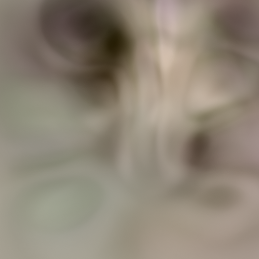 |

**逐条排除**:

| 假设 | 实验 | 结论 |
|---|---|---|
| 是步数不够 | lr 0.01 600 步 / lr 0.05 600 步 / lr 0.15 600 步 | **15.57 / 15.09 / 14.95** ⇒ **平台在 ~15 dB**,与步数和 lr 都无关 |
| 是正向链路坏了 | `G(z0, psi=1)` vs `G.synthesis(mapping(z0))` | **max\|Δ\| = 0.000e+00** ⇒ 链路逐位自洽 ⇒ **糊只能来自优化** |

⇒ **朴素 w 优化投不进 StyleGAN3**(alias-free 架构的已知性质,这里量到了)。
**这条量法要能用,得先换反演器**(LPIPS 损失 / 联合优化 noise / encoder 反演),
那是**另一个方法问题**,不是调参。

⚠️ **一处我自己的错,留痕**:收敛研究第一版的"自证 0"报 `max|Δ| = 1.508` —— 那是我拿
`psi=0.7` 的正向去比 `psi=1` 的 `mapping`,**口径不同**,不是缺陷。同口径后为 0。

★ **这条的用法**:它是"**判据必须先证明'错了会怎样'**"在本线的第一次现形 ——
数字干净、方向"合理"、**而结论完全反了**。与本仓 §P-V22 记录的
「三次换仪器,两次给出**干净但错误**的答案」是同一条教训。

---

## 3 探索阶梯

每阶给:**问题 / 做法 / 判据 / 触发重评条件**。

### 阶段 E · 真值条件源(唯一站得住的差异点)

**问题**:用**真值** depth / seg 替代估计条件,生成质量与可控性有没有可测差异?

**做法**:① 再下一个变体(`control_sd15_depth` 或 `_seg`,各 5.71 GB —— 见 §5 #1);
② 本项目已有 `surround_sem_demo`(语义 GT)与 `3dgs_sync/capture/depth`(深度 GT),
可直接当条件源;③ 与官方估计器(MiDaS / Uniformer)在同一批帧上逐条对照。

**判据**:同一 prompt、同一 seed,**换条件源**生成 —— 比 (a) 条件保真度
(生成图回投条件 vs 输入条件)、(b) 下游判据。
⚠️ **不许只看"生成得像不像"** —— 那是没有真值的代理指标(本项目能做有真值的评测)。

**触发重评条件**:真值条件与估计条件的生成质量**无可测差异** ⇒ 这条差异点不成立,
退回"用官方估计器"即可。

### 阶段 F · 可控编辑(对应 JD 的"按需生成不同天气 / 时段 / 路况")

**问题**:同一张条件图 + 换 prompt,能不能**只变天气不变布局**?

✅ **已做(2026-10-05)→ §1.5**。结论:**两个方向都成立** ——
结构余量 **+0.4186**(同条件 0.986 vs 换条件 0.568),外观亮度极差 **22.0 vs 1.6**。

**剩下没做的**:把生成的退化图与**本项目自己的 P1 退化采集**
(`kitti_ab_epic_dense_fog` 等,**有真值**)对照 —— 那才是"生成得对不对"的有真值判据,
而 §1.5 的两个描述子都只是**代理**。

### 阶段 G · 和谐化 —— ★★ **真值靶已找到**(2026-10-06,§1.12)

**问题**:把合成的内容贴进真实/CARLA 背景,**光影与材质接不接得上**?

**做法**:候选有三条,成本递增 ——
① **2D 后处理**(颜色/光照统计对齐,`image harmonization` 的经典做法);← **本轮做了基线**
② 训练一个 harmonization 网络;
③ **绕开 2D**:回到 3DGS 那条线,在**渲染层面**做(见 §4)。

**判据 —— 触发条件已达成,不再需要代理指标**:

> ✅ **§3 阶段 G 原来留的触发条件("找到真值靶")在 2026-10-06 达成了**,见 **§1.12**:
> 用 A/B 同帧跨天气粘贴造出**精确真值**(合成图 = A 帧贴 B 帧的同位置车辆区域,真值 = A 帧原样),
> 掩膜 = GT 2D 框。已经跑出读数(3.31 → 1.54,错光源对照 2.71)。

⚠️ **但靶只对"A/B 帧级配对"的场景成立** —— 换了没有配对的数据,这个靶**造不出来**
(那时才退回代理指标,且必须**明写**)。

**下一步(未做)**:拿这个靶去**训练**一条真正的 harmonization 网络 ——
它的有意义目标是**残差 1.54**(材质差),而不是"从 3.31 降多少"。

---

## 4 不做什么

| 不做 | 理由 | 触发重评条件 |
|---|---|---|
| **不新建 conda env 去复现 2021 年的 torch 1.9/1.12** | 两条链**在现成 env 里都跑通了**(§1.1/§1.2),只补了 6 个包 + 4 处 shim;新建 env 会再吃 ~10 GB 盘,而盘已经 98% | 现成 env 的 torch 升级到与 repo 不兼容时 |
| **不编 StyleGAN3 的 CUDA 扩展** | ref 实现 0.39 s/张,**根本不需要**;而编它要动 TORCH_CUDA_ARCH_LIST(与 `gs/cuda_env.py` 冲突),且本仓已因 `.so` 覆盖**踩过三次** | ref 路径成为瓶颈(batch 上界 4 不够用 / 要训练) |
| **不用 FID / LPIPS 当主要判据** | 与本仓 [edit-3dgs-plan.md](edit-3dgs-plan.md) §5 同源:能做有真值评测就用真值 | 真值靶不可得时(此时必须**明写**是代理指标) |
| **不把 StyleGAN3 的预训练权重当可用件** | 官方权重全域外(§2.2),且朴素投影投不进去(§2.3) | 有域内自训权重 |
| **不主张"接了 ControlNet = 有了图像编辑能力"** | 本轮接的是 **canny 一个变体**,而 §2.1 那条差异点用的 depth/seg **还没下** | 下到 depth/seg 并跑出对照 |

---

## 5 待决项

| # | 事项 | 状态 |
|---|---|---|
| 1 | ~~盘装不下第二个变体~~ | **已解(2026-10-05 用户扩容 220→250 G)**。已下 `control_sd15_depth`(5.71 GB)+ MiDaS(470 MB),两者 sha256 均与官方逐位一致 |
| 2 | ~~是否包成项目模块~~ | **已做**(2026-10-05 用户裁决"放 `autodrivedata/edit/`"):§1.4 |
| 3 | ~~阶段 E 的对照(真值 depth vs MiDaS)~~ | **已做**(§1.3):余量 **4.2× / 2.1× / 12.8×**,三条全中。**n = 3 帧**,是机制验证不是分布读数 |
| 3b | **`seg` 变体**(本项目的语义 tag 也是真值) | **未做**。难点不是接线,是**要造 CARLA `CityObjectLabel` → ADE20K 150 类的映射** —— 那是**人为约定**、无从对表(不像 depth 能拿 MiDaS 验)。**重评条件**:找到可验证的映射口径 |
| 4 | ~~视频编辑~~ | ✅ **已做(2026-10-06,§1.8)**:`edit/video_edit.py`。生成侧跳变 0.619 vs 真值序列 0.423(**高 46%,压线通过**)⇒ 读作"**没有系统性失配、但比真值抖**" |
| 9 | ~~判据换后端复验~~ | ✅ **已做(2026-10-06,§1.7)**:yolo **确实动**(noise 全灭 −0.182、blur/rain −0.09),而 SAM3 **全不动** ⇒ **「SAM3 钝」有一部分是后端性质**。**但 yolo 曲线同样没有分辨力 —— 基线只 0.1818(原画幅 0.669)、AP 量化到 11 档**,真因是**方裁打坏了它的尺度先验** |
| 11 | ~~解除方裁 / 换判据~~ | ✅ **已解(2026-10-06,零代码)**:换 **COCO 的 yolo26x**（`norm_cls` 本就有 `COCO_FALLBACK`）—— 基线与 SAM3 同档(0.80)且**对退化有反应**(rain 单调到 −0.207)。**letterbox 那条路不必做了** |
| 12 | ~~把 `fogdepth` 接到生成编辑产线上~~ | ✅ **已做(2026-10-06,§1.7)**;⚠️ **但那组 β 数已被 §1.11 取代** —— 它建在 **11 点**曲线上,而那条曲线**不单调**,内插无意义。修正后(101 点):真值雾 **0.0823** / 生成雾 **0.0621**(**75%**,不是 54%)。★ 「必须按 ΔAP 标定、不能按 β 对标」这条边界仍然成立(同一 Δ 在生成底图上只需 β 0.067) |
| 13 | ~~`blur` 在 COCO 下不单调~~ | ✅ **已查清(2026-10-06,§1.10)**:不是模糊的性质,是 **11 点 AP 的台阶** —— `n_tp` 从 107 跨到 108 时 recall-0.90 格点亮起(单条边界检测,`IoU 0.540` vs 0.5),AP 一步 `+0.078`;同一批检测换 101 点口径凸起整体消失。**放大倍数 = `n_gt/11 = 10.8×`**。★ **它把 §1.6 的裁决也改判了**(生成雾 Δ 从 +0.003 变 −0.062)。已工具化:`grid_cliff` / `evaluate` / `noise_curve.res` + 15 条判据 |
| 14 | ~~标定曲线按底图重标的成本~~ | ✅ **已自动化(2026-10-06,§1.11)**:新增 `edit/calibrate` —— 一条命令做**扫曲线 + 拟合 + 出配方**(`--apply` 还能直接落产物),并**自动报曲线是否单调**。★ 顺带修对口径:**标定必须走 101 点**(11 点曲线实测**非单调**,`+0.0763 / −0.0026 / −0.0013`,内插无意义)。★ 顺带修掉 `downstream_eval` 四臂**各带各的 GT**(实测 2D 差 ≤0.78 px、行序还不同)⇒ 改成**冻结一套 GT** |
| 15 | ~~`--levels` 被静默忽略~~ | ✅ **已修 + 已钉**(2026-10-06):`main` 里那行没改上(替换串被 ruff 重排过)⇒ 给了 `--levels` 也跑默认档、**不报错**。判据走 AST(`TestLevelOverrideWiring`) |
| 10 | ~~和谐化~~ | ✅ **已做,而且真值靶也找到了(2026-10-06,§1.9 + §1.12)**。§1.9 是代理版(生成图 vs 真值帧,1.6814 → 0.0356);**§1.12 是精确版** —— A/B 同帧跨天气粘贴,真值 = 原图,掩膜内 3.3128 → **1.5385**(错误对照 2.7054)。⇒ **代理指标可以退休了**。下一步是拿这个靶**训练**一条网络(目标 = 残差 1.54) |
| 5 | ~~下游闭环~~ | ✅ **已做(2026-10-06,§1.6)**:`collect_ab_route --depth` + `edit/kitti_square` + `edit/downstream_eval`。**四臂三档单调序**(地板 −0.429 / 真值雾 −0.170 / 生成雾 +0.010)。**结论是负的,而且是结构性的** —— 见 §1.6 |
| 5b | **把"条件锚住物体"这条张力拆开** | 新增。§1.6 的机制指向一个可证伪的预测:**换掉深度条件**(用 canny / 无条件 / 只给退化区域加噪)后,生成雾的下游 Δ 应当变负。**这是唯一能把"结构性张力"与"prompt 太弱"分开的实验** |
| 6 | **判据要换成"配对识别"** | 新增(§1.3.1)。整图 ρ 既不充分也不必要;`conditioned_gen` 头注已写明要改用**配对识别**(生成图能否被认回自己的条件)。**当前余量判据只是过渡** |
| 8 | ~~阶段 F(固定条件换 prompt)~~ | **已做(2026-10-05,§1.5)**:结构余量 **+0.4186**、外观亮度极差 **22.0 vs 1.6** —— **布局由条件管、外观由 prompt 管**,两个方向都成立。**剩下**:与 P1 真值退化采集对照 |
| 16 | **11 点 AP 的台阶要不要正式入红线** | **新增**。§1.10 的 `n_gt/11 = 10.8×` 放大是**全仓**的事(P1 归档矩阵、MapTR AP 口径都带它)。本轮只在 `edit/` 这条线上量了。**待裁**:是写进根 CLAUDE.md 的红线,还是只在 `eval_2d_ab` 的 docstring 里 |
| 17 | ~~SAM3 口径下的细口径复核~~ | ✅ **已做(2026-10-06,§1.10)**:四臂各一次检测、两个口径。SAM3 的 Δ_gen 从 **+0.010(11 点)** 翻成 **−0.014(101 点)**,真值雾 −0.170 → −0.150 ⇒ 生成/真值 = **9%**(COCO 是 30%)。★ **两个后端方向一致、量级不同** —— 改判不是 COCO 的偶然 |
| 7 | **runlog 环境指纹不含 `PYTHONPATH`** | 新增,且**当场踩到**:`.bashrc` 里 `source ros2_humble/install/setup.bash` **无条件**注入 ~90 条 PYTHONPATH,`launch_testing` 注册的 pytest 插件在**启动期** import 失败(缺 `lark`)⇒ **文档规定的提交前闸门 `python -m pytest -q` 直接崩**。本轮全部用 `env -u PYTHONPATH python -m pytest` 绕过。**这是"不引入 ROS2"那个结论的执行面漏洞** |

---

## 6 自证(本文件结论的可复核性)

- **权重来源与校验**:`weights/stylegan3/` 与 `weights/controlnet/MANIFEST.txt` 各记 sha256;
  ControlNet 那份已与 HF API 的 LFS oid **逐位对上**。
- ★ **下载纪律(今晚三次踩中,写死在 MANIFEST 里)**:同一个文件上**不许换下载器 / 不许并发写**。
  `curl` 顺序写 + `curl -C -` 续传 + `aria2c -x16` 分段写,三者在同一个 inode 上混用 ⇒
  **三次都得到"size 完全正确、sha256 不对"的坏文件**(最阴的一种错:尺寸对得上,
  不校验就发现不了)。可靠路径 = **单一 `aria2c --checksum=sha-256=<官方值>`**,它自己校验并重下坏段。
- **StyleGAN3 逐位复现**有自证(z 与权重双侧逐位相同),否则那条 `max|Δ| = 0` 读不出东西。
- **ControlNet 可控性**有对照(换条件臂),且**结论不建立在 IoU 上**而是建立在目检上(§1.2)。
- **投影实验的负结论**有两条独立支撑(三条 lr × 600 步平台 + 正向链路逐位自洽)。
- ★★ **AP 台阶(§1.10)**有三重证据(逐档 `tp` 与格点同步 / 换 101 点口径凸起消失 /
  逐条定位到那条 `IoU 0.540` 的检测),外加**合成对照**(`n_gt=10` 时两把尺子一致、
  `n_gt=110` 时 11 点放大 ~10×)。
- ★★ **和谐化真值靶(§1.12)**有两条自证:补丁取自真值本身 ⇒ 距离 **0**;
  **行序颠倒 ⇒ `box_shift` 必须 0**(否则会读出 215 px 的假错位)。
- ★ **标定口径(§1.11)**:11 点曲线**不单调**、101 点单调 —— 两条曲线一次跑出来对照,
  不是"相信细口径更好"。

---

## 7 与其余计划的交叉引用

| 文件 | 关系 |
|---|---|
| [edit-3dgs-plan.md](edit-3dgs-plan.md) | **3D 场景编辑**那条。本轮又挖出三条独立缺陷(§C.0.4);它的「和谐化」在 §D 有设想,与本文件 §3 阶段 G 是同一件事的两条路 |
| [edit-pointcloud-plan.md](edit-pointcloud-plan.md) | **点云编辑**那条,已以**证伪**收口(靶落在噪声里) |
| [Plan3.md](../Plan3.md) | 外部数据集对照 —— 域自适应**评测**那条线 |
| [Plan4.md](../Plan4.md) | 主线(P1/P2)。本文件与它**无耦合** |
